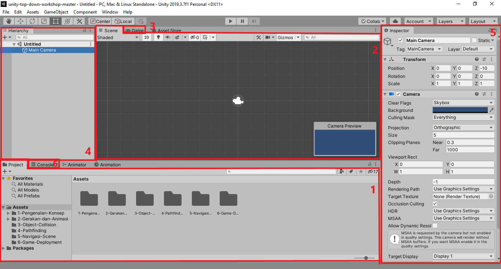
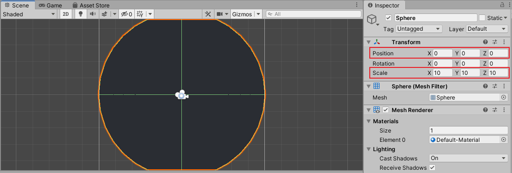

# Pengenalan Konsep

Pada bagian pertama ini kita akan membahas konsep konsep dasar dari **Unity** seperti tatap muka, _scene_, _game object_, dan hal lain yang menyangkut konsep pembuatan _game_ menggunakan **Unity** itu sendiri.
Untuk informasi, detail dari penggunaan **Unity** sebenarnya sudah tersedia secara lengkap pada [**Unity Manual**](https://docs.unity3d.com/Manual/UsingTheEditor.html).
Walaupun begitu, pada modul ini kami akan menjelaskan secara ringkas disertai dengan informasi lanjut pada setiap bagian yang bisa diakses pada **Unity Manual**.

## Tatap Muka

Secara umum, terdapat enam tatap muka utama yang akan sering digunakan selama pembuatan _game_ menggunakan **Unity**.
detail dari keenam tatap muka tersebut adalah sebagai berikut:



1. **Project Window**. Merupakan tatap muka yang menampilkan _file_ dan _asset_ yang digunakan pada suatu _project_.
2. **Scene View**. Merupakan tatap muka yang menunjukan tampilan keseluruhan _scene_.
3. **Game View**. Merupakan tatap muka yang menunjukan tampilan ketika _game_ sedang berlangsung.
4. **Hierarchy Window**. Merupakan tatap muka yang menampilkan daftar _object_ yang ada pada suatu _scene_.
5. **Inspector Window**. Merupakan tatap muka yang menampilkan detail dari suatu _object_ pada suatu _scene_ maupun _file_ dan _asset_ pada suatu _project_.
6. **Console Log**. Merupakan tatap muka yang menampilkan _log_ dari informasi maupun _error_ selama pengerjaan suatu _game_.

> Informasi lebih lanjut mengenai tatap muka utama pada **Unity** bisa dilihat [disini](https://docs.unity3d.com/Manual/UsingTheEditor.html).

Sekadar informasi, selain keenam tatap muka utama tersebut juga ada tatap muka lain yang umumnya digunakan untuk keperluan yang lebih spesifik seperti **Sprite Editor**, **Animation Editor**, **Audio Mixer**, dan lain sebagainya.

## Scene

_Scene_ merupakan hal yang merujuk pada keseluruhan lingkungan pada _game_ yang bisa berupa _menu_, _world_, _gameplay_, maupun hal lain.
Bagian utama dari _game_ yang dibuat menggunakan **Unity** terletak di _scene_-nya, dimana _scene_ sendiri akan berisi berbagai macam _object_ yang saling berinteraksi di dalamnya.
Ketika _game_ berlangsung hanya ada satu _scene_ yang bisa aktif dan agar bisa menggunakan _scene_ yang lain maka diperlukan adanya perpindahan dari satu _scene_ ke _scene_ yang lain yang nantinya akan dibahas lebih lanjut pada bagian **Navigasi dan Scene** di modul ini.

> Informasi lebih lanjut mengenai _scene_ pada **Unity** bisa dilihat [disini](https://docs.unity3d.com/Manual/CreatingScenes.html).

### Membuat Scene Baru

- Pembuatan _scene_ baru pada Unity dilakukan melalui tatap muka Project Window.
  > Untuk percobaan kali ini, kita akan membuat _scene_ baru pada _folder_ `1-Pengenalan-Konsep/Scenes`. jadi pastikan **Project Window** sudah berada pada _folder_ tersebut.
- Terdapat dua cara untuk menambahkan _scene_ baru, yakni dengan menekan tombol `+` pada bagian kiri atas lalu pilih `Scene` atau dengan klik kanan, lalu `Create`, dan pilih `Scene`.

  

- Beri nama untuk _scene_ yang akan dibuat.
- Buka _scene_ baru yang telah dibuat dengan cara _double_ klik.
  > Pada tahap ini **Scene View**, **Game View**, dan **Hierarchy Window** akan berganti sesuai dengan isi dari _scene_ yang dibuka.

## Game Object

_Game object_ merupakan hal yang merujuk pada objek-objek seperti _player_, musuh, bangunan, partikel, _button_, dan sebagainya yang ada pada suatu _scene_ di _game_.
Secara _default_, scene yang baru dibuat memiliki _game object_ `Main Camera` yang digunakan untuk menunjukan [_viewport_](https://en.wikipedia.org/wiki/Viewport) ketika _game_ sedang berlangsung.

> Informasi lebih lanjut mengenai _game object_ pada **Unity** bisa dilihat [disini](https://docs.unity3d.com/Manual/GameObjects.html).

### Membuat Game Object Baru

- Pembuatan _game object_ baru pada **Unity** dilakukan melalui tatap muka Hierarchy Window.
- Sama seperti pembuatan _scene_ baru, terdapat dua cara untuk menambahkan _game object_ baru, yakni dengan menekan tombol `+` pada bagian kiri atas lalu pilih jenis _game object_ yang diinginkan atau dengan klik kanan lalu pilih jenis _game object_ yang diinginkan.
- Sebagai contoh kita bisa memilih _game object_ dengan jenis `3D Object` -> `Sphere`. Maka akan muncul object lingkaran pada **Scene View** maupun **Game View**.

  

  > Walaupun yang dibuat adalah _game_ jenis _2D_, **Unity** tetap memperlakukan _game_ tersebut sebagai _game 3D_ dengan perspektif kamera _2D_. Hal ini bisa dilihat dengan mematikan _toggle_ `2D` pada **Scene View**.

### Transformasi Game Object

Setiap _game object_ memiliki komponen `Transform` yang digunakan untuk merepresentasikan transformasi (posisi, rotasi, dan skala) dari _game object_ pada suatu _scene_.
Terdapat dua cara untuk mengubah transformasi suatu _game object_, yakni sebagai berikut:

1. Mengubah langsung pada **Scene View** menggunakan _tools_ yang tersedia pada _toolbar_ (sebelah kiri atas), seperti `Move Tool`, `Rotate Tool`, `Scale Tool`, dan lain sebagainya.
2. Mengubah nilai dari komponen `Transform` secara langsung pada **Inspector Window**. (sebelumnya klik _game object_ pada **Scene View** atau **Hierarchy Window** untuk menampilkan detail komponen dari _game object_)

Sebagai contoh kita bisa mengubah transformasi dari _game object_ yang sebelumnya dibuat dengan mengubah nilai `Position` menjadi `(0, 0, 0)` dan `Scale` menjadi `(10, 10, 10)` pada **Inspector Window**.
Hasilnya akan didapatkan objek lingkaran besar yang berada tepat di tengah-tengah _scene_.



## Component

_Component_ merupakan bagian kecil yang menyusun suatu _game object_ pada _scene_.
Sesuai dengan prinsip pada [_component based architecture_](https://en.wikipedia.org/wiki/Component-based_software_engineering), setiap hal kecil dari _program_ akan dibentuk menjadi komponen sehingga memudahkan _prototyping_ untuk objek baru tanpa membuat ulang keseluruhan isi dari objek tersebut.
Sebagai contoh, `Transform` merupakan salah satu _component_ yang merepresentasikan transformasi dari _game object_ seperti yang dijelaskan sebelumnya, selain itu ada juga _component_ `Camera` yang digunakan untuk mengatur _view_ ketika _game_ berlangsung seperti ukuran _view_, jenis _projection_, dan lain sebagainya.

> Informasi lebih lanjut mengenai _component_ pada **Unity** bisa dilihat [disini](https://docs.unity3d.com/Manual/Components.html).

### Membuat Component Baru dengan C# Script

- Pembuatan _component_ baru dengan **C#** _script_ dilakukan melalui tatap muka **Project Window**.
  > Untuk percobaan kali ini, kita akan membuat _component_ dengan **C#** _script_ pada _folder_ `1-Pengenalan-Konsep/Scripts`. jadi pastikan **Project Window** sudah berada pada _folder_ tersebut.
- Terdapat dua cara untuk menambahkan **C#** _script_, yakni dengan menekan tombol `+` pada bagian kiri atas lalu pilih `C# Script` atau dengan klik kanan, lalu `Create`, dan pilih `C# Script`.

  

- Beri nama untuk _component_ yang akan dibuat.
  > Untuk percobaan kali ini, kita akan membuat _component_ dengan nama `Centerized` yang akan digunakan untuk membuat posisi _game object_ berada di tengah.
- Buka **C#** _script_ yang telah dibuat dengan cara _double_ klik.
  > Pada tahap ini **Unity** akan membuka _text editor_ yang menampilkan **C#** _script_ dari component `Centerized`.
  > Jika **Visual Studio** tidak terinstall, maka bisa menggunakan _text editor_ apapun seperti **Notepad**.

### Mem-Program Component Centerized

Secara _default_, isi dari **C#** _script_ yang baru dibuat adalah sebagai berikut:

```C#
using System.Collections;
using System.Collections.Generic;
using UnityEngine;

public class Centerized : MonoBehaviour
{
    // Start is called before the first frame update
    void Start()
    {

    }

    // Update is called once per frame
    void Update()
    {

    }
}
```

Inti dari _component_ yang dibuat menggunakan **C#** _script_ terletak pada fungsi `Start()` dan `Update()`.
Sesuai dengan penjelasan pada _comment line_ (baris program dengan awalan `//` yang berfungsi sebagai keterangan), fungsi `Start()` akan digunakan untuk melakukan eksekusi pertama di awal, sedangkan fungsi `Update()` akan digunakan untuk melakukan eksekusi yang dipanggil secara terus menerus di setiap _frame_.
Pada percobaan kali ini, kita akan fokus pada fungsi `Start()` saja karena proses untuk membuat _game object_ berada di tengah cukup dilakukan sekali pada eksekusi pertama di awal.

Ubah isi dari fungsi `Start()` sebagai berikut:

```C#
void Start()
{
    transform.position = new Vector3(0f, 0f, 0f);
}
```

Penjelasan singkat dari baris _program_ diatas, _program_ akan mengubah nilai `position` dari _component_ `transform` menjadi `new Vector3(0f, 0f, 0f)`.
`Vector3` sendiri merepresentasikan posisi _3D_ yang terdiri dari `x`, `y`, dan `z`, seperti pada nilai `Position` pada component `Transform` di Inspector Window.
Sedangkan `0f` sendiri berarti nilai `0` dalam bentuk _float_ (pecahan).

Setelah selesai, simpan baris _program_ tersebut.

### Menggunakan Component Centerized

- Ubah posisi objek lingkaran yang telah dibuat sebelumnya sehingga tidak berada di tengah.
- Klik objek tersebut dan Pada **Inspector Window**, klik `Add Component`.
- Cari _component_ yang bernama `Centerized`, dan kemudian tambahkan.

  

- Setelah _component_ ditambahkan, klik tombol `Play` pada Toolbar.
  > Pada tahap ini, tampilan akan terfokuskan pada **Game View**, dan objek lingkaran yang sebelumnya tidak berada di tengah akan secara otomatis terletak di tengah saat _game_ sedang berlangsung.

## Kesimpulan

Dari bagian pertama ini kita telah mengenal konsep dasar pembuatan _game_ menggunakan **Unity**. Dari sini kita bisa membuat _game_ yang terdiri dari _scene_ dengan berbagai isi objek sesuai keinginan, serta mengatur setiap objek yang ada dengan _component_ yang bisa kita buat sendiri.

Pada bagian selanjutnya kita akan membahas lebih lanjut mengenai manipulasi objek menggunakan _component_ yang dibuat sendiri, terutama soal mengatur gerakan dan animasi dari _game object_ tersebut, serta mengatur interaksi antara pemain dengan _game_ yang akan dibuat.

[Lanjut Bagian Kedua, Gerakan dan Animasi](../2-Gerakan-dan-Animasi/README.md)
