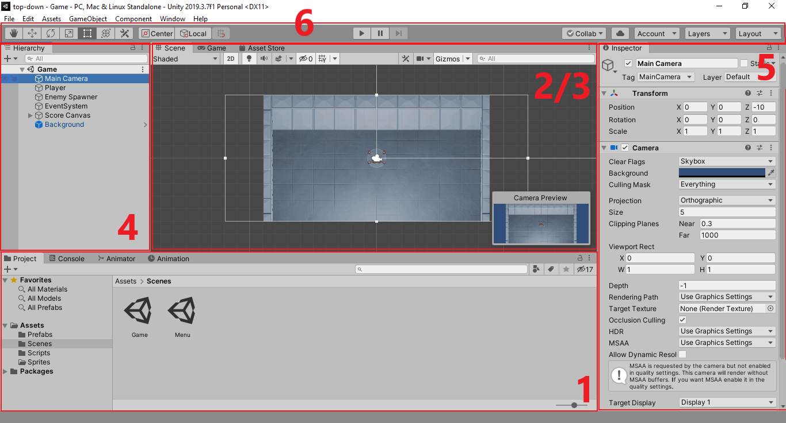
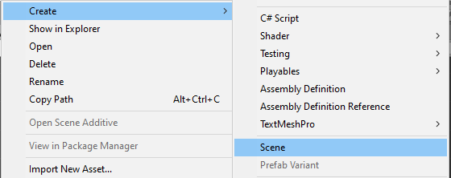
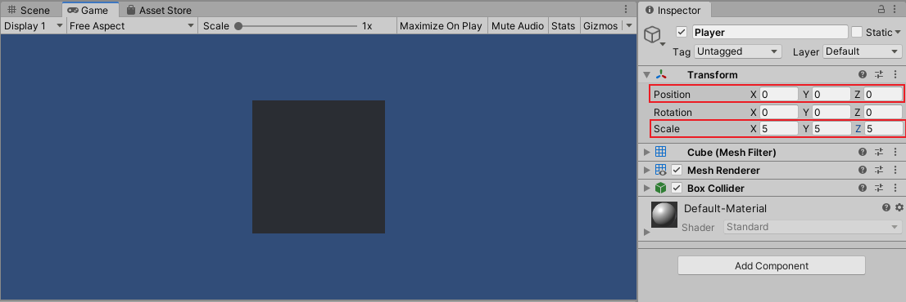
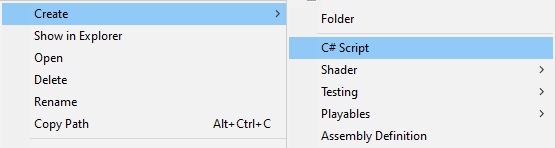

# Pengenalan Konsep

Pada bagian pertama ini kita akan membahas konsep konsep dasar dari **Unity** seperti tatap muka, _scene_, _game object_, dan hal lain yang menyangkut konsep pembuatan _game_ menggunakan **Unity** itu sendiri.
Untuk informasi, detail dari penggunaan **Unity** sebenarnya sudah tersedia secara lengkap pada [**Unity Manual**](https://docs.unity3d.com/Manual/UsingTheEditor.html).
Walaupun begitu, pada modul ini kami akan menjelaskan secara ringkas disertai dengan informasi lanjut pada setiap bagian yang bisa diakses pada **Unity Manual**.

## Tatap Muka

Secara umum, terdapat enam tatap muka utama yang akan sering digunakan selama pembuatan _game_ menggunakan **Unity**.
detail dari keenam tatap muka tersebut adalah sebagai berikut:



1. **Project Window**. Merupakan tatap muka yang menampilkan _file_ dan _asset_ yang digunakan pada suatu _project_.
2. **Scene View**. Merupakan tatap muka yang menunjukan tampilan keseluruhan _scene_.
3. **Game View**. Merupakan tatap muka yang menunjukan tampilan ketika _game_ sedang berlangsung.
4. **Hierarchy Window**. Merupakan tatap muka yang menampilkan daftar _object_ yang ada pada suatu _scene_.
5. **Inspector Window**. Merupakan tatap muka yang menampilkan detail dari suatu _object_ pada suatu _scene_ maupun _file_ dan _asset_ pada suatu _project_.
6. **Console Log**. Merupakan tatap muka yang menampilkan _log_ dari informasi maupun _error_ selama pengerjaan suatu _game_.

> Informasi lebih lanjut mengenai tatap muka utama pada **Unity** bisa dilihat [disini](https://docs.unity3d.com/Manual/UsingTheEditor.html).

Sekadar informasi, selain keenam tatap muka utama tersebut juga ada tatap muka lain yang umumnya digunakan untuk keperluan yang lebih spesifik seperti **Sprite Editor**, **Animation Editor**, **Audio Mixer**, dan lain sebagainya.

## Scene

_Scene_ merupakan hal yang merujuk pada keseluruhan lingkungan pada _game_ yang bisa berupa _menu_, _world_, _gameplay_, maupun hal lain.
Bagian utama dari _game_ yang dibuat menggunakan **Unity** terletak di _scene_-nya, dimana _scene_ sendiri akan berisi berbagai macam _object_ yang saling berinteraksi di dalamnya.
Ketika _game_ berlangsung hanya ada satu _scene_ yang bisa aktif dan agar bisa menggunakan _scene_ yang lain maka diperlukan adanya perpindahan dari satu _scene_ ke _scene_ yang lain yang nantinya akan dibahas lebih lanjut pada bagian **Navigasi dan Scene** di modul ini.

> Informasi lebih lanjut mengenai _scene_ pada **Unity** bisa dilihat [disini](https://docs.unity3d.com/Manual/CreatingScenes.html).

### Membuat Scene Baru

- Pembuatan _scene_ baru pada Unity dilakukan melalui tatap muka Project Window.

  > Secara umum, _asset_ yang berbentuk _scene_ diletakkan pada _folder_ bernama `Scenes`.
  > jadi pastikan **Project Window** sudah berada pada _folder_ tersebut.

- Terdapat dua cara untuk menambahkan _scene_ baru, yakni dengan menekan tombol `+` pada bagian kiri atas lalu pilih `Scene` atau dengan klik kanan, lalu `Create`, dan pilih `Scene`.

  

- Beri nama _scene_ yang dibuat dengan nama `Game`.
- Buka _scene_ baru yang telah dibuat dengan cara _double_ klik.

  > Pada tahap ini **Scene View**, **Game View**, dan **Hierarchy Window** akan berganti sesuai dengan isi dari _scene_ yang dibuka.

## Game Object

_Game object_ merupakan hal yang merujuk pada objek-objek seperti _player_, musuh, bangunan, partikel, _button_, dan sebagainya yang ada pada suatu _scene_ di _game_.
Secara _default_, scene yang baru dibuat memiliki _game object_ `Main Camera` yang digunakan untuk menunjukan [_viewport_](https://en.wikipedia.org/wiki/Viewport) ketika _game_ sedang berlangsung.

> Informasi lebih lanjut mengenai _game object_ pada **Unity** bisa dilihat [disini](https://docs.unity3d.com/Manual/GameObjects.html).

### Membuat Game Object Baru

- Pembuatan _game object_ baru pada **Unity** dilakukan melalui tatap muka Hierarchy Window.
- Sama seperti pembuatan _scene_ baru, terdapat dua cara untuk menambahkan _game object_ baru, yakni dengan menekan tombol `+` pada bagian kiri atas lalu pilih jenis _game object_ yang diinginkan atau dengan klik kanan lalu pilih jenis _game object_ yang diinginkan.
- Untuk percobaan kali ini, kita akan membuat _game object_ dengan jenis `3D Object` -> `Cube`. Setelah itu akan muncul objek persegi pada **Scene View** maupun **Game View**.

  

  > Walaupun yang dibuat adalah _game_ jenis _2D_, **Unity** tetap memperlakukan _game_ tersebut sebagai _game 3D_ dengan perspektif kamera _2D_. Hal ini bisa dilihat dengan mematikan _toggle_ `2D` pada **Scene View**.

- Beri nama _game object_ yang baru dibuat dengan nama `Player`.

### Transformasi Game Object

Setiap _game object_ memiliki _component_ `Transform` yang digunakan untuk merepresentasikan transformasi (posisi, rotasi, dan skala) dari _game object_ pada suatu _scene_.
Terdapat dua cara untuk mengubah transformasi suatu _game object_, yakni sebagai berikut:

1. Mengubah langsung pada **Scene View** menggunakan _tools_ yang tersedia pada _toolbar_ (sebelah kiri atas), seperti `Move Tool`, `Rotate Tool`, `Scale Tool`, dan lain sebagainya.
2. Mengubah nilai dari _component_ `Transform` secara langsung pada **Inspector Window**. (sebelumnya klik _game object_ pada **Scene View** atau **Hierarchy Window** untuk menampilkan detail _component_ dari _game object_)

> Informasi lebih lanjut mengenai Transformasi _game object_ pada Unity bisa dilihat [disini](https://docs.unity3d.com/Manual/Transforms.html).

Sebagai contoh kita bisa mengubah transformasi dari _game object_ yang sebelumnya dibuat dengan mengubah nilai `Position` menjadi `(0, 0, 0)` dan `Scale` menjadi `(5, 5, 5)` pada **Inspector Window**.
Hasilnya akan didapatkan objek persegi besar yang berada tepat di tengah-tengah _scene_.



## Component

_Component_ merupakan bagian kecil yang menyusun suatu _game object_ pada _scene_.
Sesuai dengan prinsip pada [_component based architecture_](https://en.wikipedia.org/wiki/Component-based_software_engineering), setiap hal kecil dari _program_ akan dibentuk menjadi komponen sehingga memudahkan _prototyping_ untuk objek baru tanpa membuat ulang keseluruhan isi dari objek tersebut.
Sebagai contoh, `Transform` merupakan salah satu _component_ yang merepresentasikan transformasi dari _game object_ seperti yang dijelaskan sebelumnya, selain itu ada juga _component_ `Camera` yang digunakan untuk mengatur _view_ ketika _game_ berlangsung seperti ukuran _view_, jenis _projection_, dan lain sebagainya.

> Informasi lebih lanjut mengenai _component_ pada **Unity** bisa dilihat [disini](https://docs.unity3d.com/Manual/Components.html).

### Membuat Component Baru dengan C# Script

- Pembuatan _component_ baru dengan **C#** _script_ dilakukan melalui tatap muka **Project Window**.

  > Secara umum, _asset_ yang berbentuk **C#** _script_ diletakkan pada _folder_ bernama `Scripts`.
  > jadi pastikan **Project Window** sudah berada pada _folder_ tersebut.

- Terdapat dua cara untuk menambahkan **C#** _script_, yakni dengan menekan tombol `+` pada bagian kiri atas lalu pilih `C# Script` atau dengan klik kanan, lalu `Create`, dan pilih `C# Script`.

  

- Beri nama _component_ yang baru dibuat dengan nama `RandomStart`.

  > Untuk percobaan kali ini, kita akan membuat _component_ dengan nama `Random Start` yang akan digunakan untuk membuat posisi _game object_ terletak secara acak di awal.

- Buka **C#** _script_ yang telah dibuat dengan cara _double_ klik.

  > Pada tahap ini **Unity** akan membuka _text editor_ yang menampilkan **C#** _script_ dari component `Random Start`.
  > Jika **Visual Studio** tidak terinstall, maka bisa menggunakan _text editor_ apapun seperti **Notepad**.

### Mem-Program Component Random Start

Secara _default_, isi dari **C#** _script_ yang baru dibuat adalah sebagai berikut:

```C#
using System.Collections;
using System.Collections.Generic;
using UnityEngine;

public class RandomStart : MonoBehaviour
{
    // Start is called before the first frame update
    void Start()
    {

    }

    // Update is called once per frame
    void Update()
    {

    }
}
```

Inti dari _component_ yang dibuat menggunakan **C#** _script_ terletak pada fungsi `Start()` dan `Update()`.
Sesuai dengan penjelasan pada _comment line_ (baris _program_ dengan awalan `//` yang berfungsi sebagai keterangan), fungsi `Start()` akan digunakan untuk melakukan eksekusi pertama di awal, sedangkan fungsi `Update()` akan digunakan untuk melakukan eksekusi yang dipanggil secara terus menerus di setiap _frame_.
Pada percobaan kali ini, kita akan fokus pada fungsi `Start()` saja karena proses untuk membuat _game object_ berada di tengah cukup dilakukan sekali pada eksekusi pertama di awal.

Ubah isi dari fungsi `Start()` sebagai berikut:

```C#
void Start()
{
    Vector3 position = transform.position;
    position.x = Random.Range(-10, 10);

    transform.position = position;
}
```

Penjelasan singkat dari baris _program_ diatas, _program_ akan menyimpan nilai `transform.position` ke variabel sementara `position` yang berupa `Vector3`.
`Vector3` sendiri merepresentasikan posisi _3D_ yang terdiri dari `x`, `y`, dan `z`, seperti pada nilai `Position` pada _component_ `Transform` di **Inspector Window**.
Kemudian _program_ akan mengubah nilai `x` dari `position` dengan angka acak dari kisaran `-10` hingga `10` dan menge-_set_-nya kembali ke variabel `transform.position`.

> Sebagai catatan, `transform` merupakan [_member variable_](https://en.wikipedia.org/wiki/Member_variable) yang memiliki [tipe data](https://en.wikipedia.org/wiki/Data_type) _class_ `Transform`.
> Dalam sisi pemrograman, _class_ `Transform` merupakan _class_ yang merepresentasikan isi dan fungsi dari _component_ `Transform` yang ada pada _game object_.
> Informasi lebih lanjut mengenai _class_ `Transform` bisa dilihat [disini](https://docs.unity3d.com/ScriptReference/Transform.html).

Setelah selesai, simpan baris _program_ tersebut.

### Menggunakan Component RandomStart

- Buka _scene_ `Game` yang sebelumnya sudah dibuat.
- Klik objek `Player` dan Pada **Inspector Window**, klik `Add Component`.
- Cari _component_ yang bernama `Random Start`, dan kemudian tambahkan.

  

- Setelah _component_ ditambahkan, klik tombol `Play` pada **Toolbar** untuk melihat hasilnya.

  > Pada tahap ini, tampilan akan terfokuskan pada **Game View**, dan objek `Player` akan secara otomatis berpindah tempat pada posisi yang berbeda saat _game_ sedang berlangsung.

  > Sebagai tambahan, jika di-_play_ berulang kali, posisi awal dari objek `Player` akan berbeda dengan posisi yang didapatkan pada _game_ yang berlangsung sebelumnya.
  > Hal ini terjadi karena fungsi `Random.Range()` akan memilih angka acak sesuai dengan parameter yang diberikan.

## Order of Execution

_Order of execution_ merupakan istilah yang merujuk pada urutan dari pemanggilan _event_ pada sistem **Unity**.
Salah satu dari _event_ tersebut nantinya akan memanggil fungsi yang ada pada _component_ seperti `Start()` dan `Update()` yang sudah dijelaskan sebelumnya.
Pada bagian ini kita akan membahas lebih lanjut mengenai bagaimana pengaruh _order of execution_ ini terhadap _looping_ dari suatu game, sehingga alur dari sistem bisa bekerja sesuai dengan yang diinginkan.

> Informasi lebih lanjut mengenai _order of execution_ pada **Unity** bisa dilihat [disini](https://docs.unity3d.com/Manual/ExecutionOrder.html).

### Component Up Movement

Pada percobaan kali ini, kita akan membuat _component_ baru yang akan digunakan untuk membuat objek bergerak ke atas selama game sedang berlangsung
Untuk itu, pertama, buat **C#** _script_ baru dan beri nama `Up Movement`.

Buka **C#** _script_ tersebut dan ubah isi dari fungsi `Update()` sebagai berikut:

```c#
void Update()
{
    Vector3 translation = new Vector3(0, 5, 0);
    transform.Translate(translation * Time.deltaTime);
}
```

Penjelasan singkat dari baris _program_ diatas, _program_ akan membuat variabel `Vector3` baru dengan nilai `0`, `5`, `0`.
Kemudian _program_ akan memanggil fungsi `Translate()` dari `transform` dengan parameter yang berupa variabel yang sudah dibuat sebelumnya dikalikan dengan `Time.deltaTime`.
Maksud dari fungsi `Translate()` sendiri adalah untuk mentranslasi (menggerakkan) objek ke arah vektor yang sudah dibuat sebelumnya.

> Sebagai catatan, `Time.deltaTime` merupakan nilai selisih waktu antara frame sebelum dan frame sekarang.
> Perkalian dengan `Time.deltaTime` pada **Unity** umumnya digunakan untuk menghindari adanya gerakan yang patah patah ketika game sedang berlangsung.
> Informasi lebih lanjut mengenai perlunya `Time.deltaTime` bisa dilihat [disini](https://answers.unity.com/questions/296336/timedeltatime.html).

Setelah selesai, simpan baris _program_ tersebut.

### Menggunakan Component Up Movement

- Buka _scene_ `Game` yang sebelumnya sudah dibuat.
- Tambahkan _component_ `Up Movement` pada objek `Player`.
- Klik tombol `Play` untuk melihat hasilnya.

  > Pada tahap ini, objek `Player` akan bergerak ke atas.
  > Hal ini bisa terjadi karena pada fungsi `Update()`, transformasi dari objek akan dilakukan translasi secara terus menerus di setiap _frame_ sehingga menimbulkan kesan seolah-olah sedang bergerak ke atas.

## Kesimpulan

Dari bagian pertama ini kita telah mengenal konsep dasar pembuatan _game_ menggunakan **Unity**. Dari sini kita bisa membuat _game_ yang terdiri dari _scene_ dengan berbagai isi objek sesuai keinginan, serta mengatur setiap objek yang ada dengan _component_ yang bisa kita buat sendiri.

Pada bagian selanjutnya kita akan membahas lebih lanjut mengenai manipulasi objek menggunakan _component_ yang dibuat sendiri, terutama soal mengatur gerakan dari _game object_ serta mengatur interaksi antara pemain dengan _game_ yang akan dibuat.

[Lanjut Bagian Kedua, Input dan Gerakan](../2-Input-dan-Gerakan/README.md)
