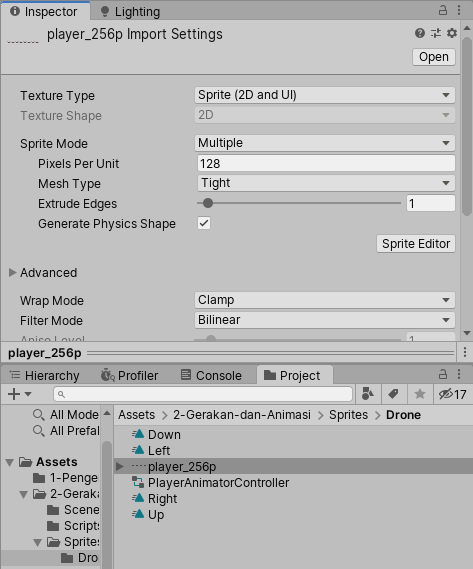
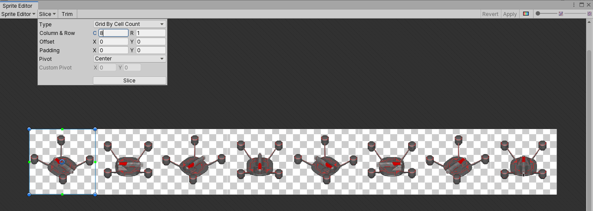
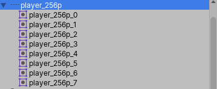
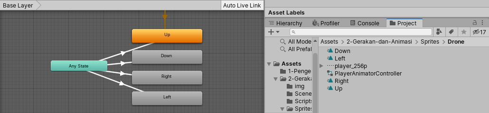
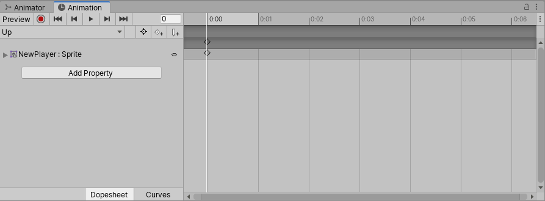
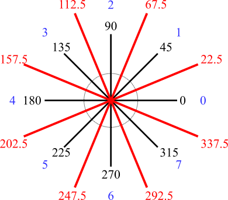
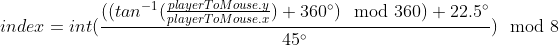

# Input dan Gerakan

Pada bagian kedua dari modul ini, kita akan membahas mengenai interaksi pemain dengan game melalui _input_ yang diberikan oleh pemain.
Serta bagaimana sistem akan merespon _input_ dari pemain tersebut, yang mana salah satunya adalah dengan menggerakkan objek yang dikendalikan oleh pemain.
Selain soal _input_ dan gerakan, pada bagian ini kita juga akan menyinggung beberapa hal lain yang akan membantu pengembangan game ini dari sisi _input_ dan gerakan seperti soal _public property_, _prefab_, dan lain sebagainya.

## Input

Salah satu keunggulan dari **Unity** adalah sifatnya yang _cross platform_.
Karena itu juga, **Unity** secara penuh mendukung berbagai macam jenis _input_ yang bisa digunakan seperti _keyboard_, _joystick_, _touch screen_, hingga _controller_ [_VR_](https://en.wikipedia.org/wiki/Virtual_reality) dan [_AR_](https://en.wikipedia.org/wiki/Augmented_reality).
Pada bagian ini, kita akan membahas lebih lanjut mengenai bagaimana _input_ di **Unity** bekerja, terutama soal _input_ yang menggunakan _keyboard_.

> Informasi lebih lanjut mengenai _input_ pada **Unity** bisa dilihat [disini](https://docs.unity3d.com/Manual/Input.html).

### Input Manager

Di **Unity**, _input_ secara umum akan diperlakukan sebagai _axis_, termasuk untuk _input_ yang seharusnya berupa _button_.
_Axis_ sendiri merupakan representasi _input_ yang memiliki dua arah yang saling berlawanan (negatif dan positif), biasanya digunakan sebagai input arah, seperti pada tombol _left_/_right_ atau _axis_ pada _joystick_.
Bagian yang mengatur _input_ pada **Unity** sendiri adalah **Input Manager** yang bisa diakses melalui menu `Edit` -> `Project Settings...` -> `Input Manager`.


Dengan adanya **Input Manager**, kita bisa mengatur berbagai macam _input_ dalam bentuk _axis_ yang dibutuhkan pada _game_ yang kita buat, seperti mengubah nama _axis_ maupun mengubah tombol yang mempengaruhi _axis_ tersebut.
Seperti pada contoh _default_, kita bisa mengetahui jika _axis_ `Horizontal` dipengaruhi oleh tombol _left_ dan _right_ sedangkan _axis_ `Vertical` dipengaruhi oleh tombol _down_ dan _up_.

> Informasi lebih lanjut mengenai **Input Manager** pada **Unity** bisa dilihat [disini](https://docs.unity3d.com/Manual/class-InputManager.html).

## Mengendalikan Pergerakan Objek

Pada percobaan kali ini, kita akan membuat _component_ baru yang akan digunakan untuk mengendalikan pergerakan objek selama _game_ sedang berlangsung menggunakan _input_ yang tersedia.

### Membuat Component MovementInput

Buat **C#** _script_ baru dan beri nama `MovementInput`, kemudian buka **C#** _script_ tersebut dan ubah isi dari fungsi `Update()` sebagai berikut:

```c#
void Update()
{
    float inputX = Input.GetAxisRaw("Horizontal");
    float inputY = Input.GetAxisRaw("Vertical");

    Vector3 translation = new Vector3(inputX, inputY, 0f);
    translation.Normalize();

    transform.Translate(translation * Time.deltaTime);
}
```

Penjelasan singkat dari baris _program_ diatas, _program_ akan mengambil nilai dari _axis_ `Horizontal` dan `Vertical` secara _raw_ menggunakan fungsi `GetAxisRaw()` dan kemudian menyimpannya ke dalam variabel `inputX` dan `inputY` secara berurutan.
Istilah _raw_ pada `GetAxisRaw()` sendiri menandakan bahwa input yang diberikan tidak akan mengalami _smoothing_.

> Sebagai catatan, `GetAxisRaw()` merupakan [_static method_](https://en.wikipedia.org/wiki/Method_(computer_programming)#Static_methods) dari _class_ `Input`, sehingga bisa dipanggil langsung tanpa perlunya instansi dari _class_ tersebut.
> Informasi lebih lanjut mengenai _class_ `Input` bisa dilihat [disini](https://docs.unity3d.com/ScriptReference/MonoBehaviour.html).

Kemudian dari kedua nilai _input_ yang didapatkan, dibentuklah `Vector3` baru yang kemudian di-[_normalize_](https://en.wikipedia.org/wiki/Unit_vector) agar gerakan _diagonal_ dari objek tidak lebih cepat dari gerakan yang lain.
Setelah itu, fungsi `Translate()` akan dipanggil menggunakan nilai `Vector3` yang sudah dibuat sebelumnya dikalikan dengan `Time.deltaTime`.
Fungsi `Translate()` ini memiliki kegunaan yang sama dengan fungsi `Rotate()` seperti yang dijelaskan di bagian sebelumnya.
Hanya saja alih alih merubah nilai `Rotation`, fungsi `Translate()` ini digunakan untuk merubah nilai `Position` dari _component_ `Transform`.

> Sebagai catatan, `Time.deltaTime` merupakan nilai selisih waktu antara frame sebelum dan frame sekarang.
> Perkalian dengan `Time.deltaTime` pada **Unity** umumnya digunakan untuk menghindari adanya gerakan yang patah patah ketika game sedang berlangsung.
> Informasi lebih lanjut mengenai perlunya `Time.deltaTime` bisa dilihat [disini](https://answers.unity.com/questions/296336/timedeltatime.html).

Setelah selesai, simpan baris _program_ tersebut.

### Mencoba Component MovementInput

- Buat _scene_ baru, beri nama `Game`, dan buka _scene_ tersebut.
- Buat _game object_ baru, beri nama `Player`, dan tambahkan _component_ `MovementInput`.
  > Anda bebas menggunakan _game object_ jenis apapun selama _game object_ tersebut bisa ditransformasikan dan tampak ketika _game_ sedang berlangsung.
- Klik tombol `Play` untuk melihat hasilnya.

  

  > Pada tahap ini, dengan menekan tombol _left_, _right_, _down_, maupun _up_ akan mengakibatkan objek bergerak sesuai dengan arah dari tombol tersebut.
  > Hal ini bisa terjadi karena di setiap _frame_, _component_ `MovementInput` akan mengubah nilai `Position` dari _component_ `Transform` sesuai dengan _axis_ dari _input_ yang diberikan oleh pemain.

## Public Property

Pada bagian sebelumnya, kita telah membuat _component_ `MovementInput` untuk menggerakkan objek yang kita inginkan.
Namun, gerakan dari _component_ yang telah kita buat terasa cukup lambat, dan kita juga tidak bisa mengatur kecepatan dari objek yang kita kendalikan sesuai dengan keinginan kita.
Oleh karena itu, **Unity** mengenal sebuah istilah yang bernama _public property_.
Secara umum, [_property_](https://en.wikipedia.org/wiki/Property_(programming)) sendiri digunakan untuk mendefiniskan variabel yang dimiliki oleh suatu _class_.
Dengan menjadikan suatu _property_ sebagai _public_, maka nilai dari _property_ tersebut bisa diubah secara langsung melalui **Inspector Window** tanpa perlu mengubahnya melalui **C#** _script_.

Buka kembali **C#** _script_ dari _component_ `MovementInput` dan ubah sebagai berikut:

```c#
public class MovementInput : MonoBehaviour
{
    public float speed = 1f;

    ...

    void Update()
    {
        ...

        transform.Translate(translation * Time.deltaTime * speed);
    }
}
```

Penjelasan singkat dari baris _program_ diatas, nilai translasi sebelumnya dari _component_ `MovementInput` akan dikalikan dengan _public property_ `speed` yang secara _default_ bernilai `1f`.
Nantinya, besar dari translasi (kecepatan dari objek) akan dipengaruhi oleh nilai dari _public property_ tersebut.

Setelah selesai, simpan baris _program_ tersebut.
Kemudian pada _component_ `MovementInput` akan terdapat _input field_ baru dengan nama `Speed`, nilai dari _input field_ tersebut bisa diubah sesuai dengan keinginan.
Hasilnya ketika _game_ sedang berlangsung, kecepatan dari _game object_ yang dikendalikan oleh pemain akan semakin lambat maupun semakin cepat sesuai dengan nilai `Speed` yang diberikan.


## Mengendalikan Perputaran Objek

Pada percobaan kali ini, kita akan membuat _component_ baru yang akan digunakan untuk mengendalikan perputaran objek berdasarkan posisi dari _mouse_ selama _game_ sedang berlangsung.

### Membuat Component RotationInput

Buat **C#** _script_ baru dan beri nama `RotationInput`, kemudian buka **C#** _script_ tersebut dan ubah isi dari fungsi `Update()` sebagai berikut:

```C#
void Update()
{
  Vector3 mousePosition = Camera.main.ScreenToWorldPoint(Input.mousePosition);
  Vector3 mouseDirection = mousePosition - transform.position;

  float angle = Mathf.Atan2(mouseDirection.y, mouseDirection.x) * Mathf.Rad2Deg;

  transform.eulerAngles = new Vector3(0f, 0f, angle);
}
```

Penjelasan singkat dari baris _program_ diatas, inti dari _program_ tersebut adalah mengubah nilai _input_ dari posisi _mouse_ yang awalnya berdasarkan posisi _screen_ (_2D_) menjadi posisi _world_ (_3D_) dan menyimpannya ke dalam variabel `mousePosition`.
Kemudian dihitung selisih dari posisi _mouse_ dengan posisi dari objek dan disimpan dalam variabel `mouseDirection` dalam bentuk vektor.
Dari vektor tersebut, kemudian dihitung nilai dari sudut tersebut menggunakan perhitungan fungsi _atan2_ yang nantinya akan di-_set_ ke nilai `eulerAngles` (atau `Rotation`) dari _component_ `Transform`.

> [_Atan2_](https://en.wikipedia.org/wiki/Atan2), dikenal juga sebagai _2-argument arctangent_, merupakan fungsi yang digunakan untuk mendapatkan nilai sudut berdasarkan arah _x_ dan _y_.
> Berbeda dengan _atan_ yang hanya menghasilkan sudut 180 derajat, _atan2_ bisa digunakan untuk menghasilkan sudut hingga 360 derajat.

Setelah selesai, simpan baris _program_ tersebut.

### Mencoba Component RotationInput

- Buka _scene_ `Game` yang sebelumnya sudah dibuat.
- Pada _game object_ `Player`, tambahkan _component_ `RotationInput`.
- Klik tombol `Play` untuk melihat hasilnya.

  

  > Pada tahap ini, objek akan selalu bergerak berputar menghadap ke posisi mouse.
  > Hal ini sesuai dengan perhitungan _atan2_ pada _component_ `RotationInput` yang digunakan untuk mendapat sudut dari perputaran sehingga seolah-olah objek akan selalu menghadap ke arah posisi _mouse_.

## Sprite

### Menambahkan Sprite Pada Game Object

### Mengatur Sprite Untuk Rotasi

## Kesimpulan

## Mengatur Animasi _Sprite_
_Unity_ menyediakan dua _interface_ untuk mengatur animasi; _Animation_ dan _Animator Controller_. _Animation_ adalah objek yang menyimpan tindakan apa saja yang harus dilakukan selama satu animasi berjalan, sedangkan _Animator Controller_ adalah objek yang mengatur alur berjalannya kumpulan _Animation_. Kali ini kita akan mencoba mengubah _sprite_ (gambar yang ditampilkan untuk sebuah objek) melalui kedua _interface_ tersebut.

Pertama, kita atur _spritesheet_ yang berada pada folder _2-Gerakan-dan-Animasi > Sprites > Drone >_ untuk membagi kumpulan gambar pada _spritesheet_ menjadi gambar-gambar individu. Pilih gambar _player256.png_, kemudian perhatikan panel _Inspector_. Atur _spritesheet_ sesuai dengan pengaturan pada gambar berikut. Setelah itu, pilih "_Sprite Editor_".



Pada _Sprite Editor_, pilih menu _Slice_, kemudian pada opsi _Type_, pilih _Grid By Cell Count_. Isikan kotak _C_ saja dengan nilai 8. Tekan _Slice_ dan simpan perubahan dengan menekan tombol _Apply_. _Spritesheet_ yang telah kita atur siap dipakai untuk dimasukkan ke objek _Animation_.




Untuk menambahkan potongan _spritesheet_ ke dalam _Animation_, kita perlu menambahkan _component Animator Controller_ terlebih dahulu ke objek _player_. _Component Animator Controller_ ini perlu sebuah objek _Animator Controller_ yang bisa kita buat pada panel _Project_ dengan meng-klik kanan _window Project_, kemudian pilih _Create > Animator Controller_. Kemudian kita buat objek _Animation_ dengan meng-klik kanan pada _window Project_, pilih _Create > Animation_. Untuk bab ini kita buat empat objek _Animation_ dengan nama _Up_, _Down_, _Right_, dan _Left_. _Double-click_ objek _Animator Controller_ yang baru saja dibuat, kemudian _drag_ semua objek _Animation_ yang telah dibuat ke _window Animator Controller_ yang telah muncul.



Buka _window Animation_ untuk mulai mengatur animasi _sprite_ dengan memilih menu _Window > Animation > Animation_. Dengan objek _player_ terpilih, akan muncul _drop down menu_ di bawah teks _Preview_ yang menampilkan seluruh _Animation_ yang berada di dalam _Animator Controller_ objek _player_. Kita coba atur _Animation_ bernama _Up_ terlebih dahulu. Untuk memberi gambar pada _Animation_, cukup pindahkan _sprite_ yang menunjukkan _player_ menghadap ke atas ke panel di mana tombol _Add Property_ berada. Secara otomatis potongan _sprite_ akan masuk ke _keyframe_ ke-0.



Berpindah ke _window Animator Controller_, kita atur bagaimana transisi tiap animasi berjalan. Setiap kotak yang Anda lihat di _window Animator Controller_ disebut sebagai _state_, baik kotak bertuliskan _Any State_, _End_, _Start_, dan _Animation_ yang telah Anda masukkan. Di _Animator Controller_ kita mengatur bagaimana alur perpindahan _state_ berjalan. Karena animasi pergerakan _player_ dapat berubah tergantung arah perpindahan _player_ dan tidak peduli pada arah mana _player_ menghadap, kita hubungkan kotak _Any State_ ke-empat _Animation_ kita dengan meng-klik kanan kotak _Any State_, pilih _Make Transition_, kemudian pilih _Animation_ yang ingin dihubungkan.

Transisi animasi akan berjalan apabila beberapa kondisi terpenuhi. Pada _Animator Controller_ terdapat empat macam tipe parameter yang bisa kita gunakan untuk menyusun kondisi transisi animasi; _float_, _integer_, _bool_, dan _trigger_. Parameter-parameter yang dibutuhkan terdapat pada tab _parameters_. Kita buat paramater baru bertipe _integer_. Penjelasan mengenai penggunaan parameter akan diterangkan pada sub-bab berikutnya.

## Mengubah _Sprite_ Objek _Player_ Berdasarkan Posisi _Mouse_
Kita akan mengaplikasikan teori trigonometri untuk membantu pekerjaan kita menentukan _sprite player_ yang harus ditampilkan sesuai dengan posisi _mouse_ terhadap objek _player_.

Perhatikan gambar berikut:



Kita memiliki _spritesheet_ yang terdiri dari delapan gambar berbeda yang juga menghadap ke arah yang berbeda juga. Pada gambar, garis hitam menunjukkan besar sudut yang dimiliki _spritesheet_ kita, sedangkan garis merah adalah jangkauan yang apabila posisi _mouse_ berada di antara kedua garis merah, maka _player_ akan "menghadap" ke arah dengan sudut sesuai dengan garis hitam yang terapit oleh kedua garis merah tersebut. Angka biru adalah indeks arah, dengan 0 menghadap ke kanan, 1 menghadap ke kanan atas, dan seterusnya. Indeks inilah yang akan kita cari untuk mengatur transisi animasi pada _Animator Controller_.

Perhitungan untuk mendapatkan indeks didefinisikan dengan rumus berikut:


_playerToMouse_ adalah vektor yang menghubungkan posisi _mouse_ dengan posisi _player_. Posisi _mouse_ didapat dengan menggunakan fungsi _Camera.ScreenToWorldPoint()_, di mana input yang dibutuhkan adalah posisi _mouse_ pada layar (diperoleh dari _Input.mousePosition_).

```C#
    Vector3 mouseScreenToWorld = Camera.main.ScreenToWorldPoint(Input.mousePosition);
    Vector3 mouseToPlayer = (mouseScreenToWorld - transform.position);
    int directionID = (int)((((Mathf.Atan2(mouseToPlayer.y, mouseToPlayer.x) * Mathf.Rad2Deg)+360f)%360 + 22.5f)/ 45)%8;
```

Indeks yang didapat kemudian diteruskan ke parameter pada _Animator Controller_ melalui fungsi _AnimatorController.SetInteger()_ yang mengambil dua paramater; nama parameter yang akan diatur nilainya dan besar nilai yang akan diberikan.

Berikut adalah isi program pada file _MovementInput.cs_ per bab kedua:
```C#
public class MovementInput : MonoBehaviour
{
  private int directionID;
  private Animator animator;
  private Vector3 mouseScreenToWorld, mouseToPlayer;
  public float speed = 5f;

  void Start()
  {
    animator = gameObject.GetComponent<Animator>();
  }

  void Update()
  {
    float inputX = Input.GetAxisRaw("Horizontal");
    float inputY = Input.GetAxisRaw("Vertical");

    Vector3 movement = new Vector3(inputX, inputY, 0f).normalized;
    mouseScreenToWorld = Camera.main.ScreenToWorldPoint(Input.mousePosition);
    mouseToPlayer = (mouseScreenToWorld - transform.position);
    directionID = (int)((((Mathf.Atan2(mouseToPlayer.y, mouseToPlayer.x) * Mathf.Rad2Deg)+360f)%360 + 22.5f)/ 45)%8;

    animator.SetInteger("directionIndex", directionID);
    transform.Translate(movement * speed * Time.deltaTime);
  }
}
```