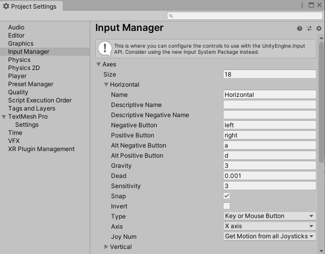
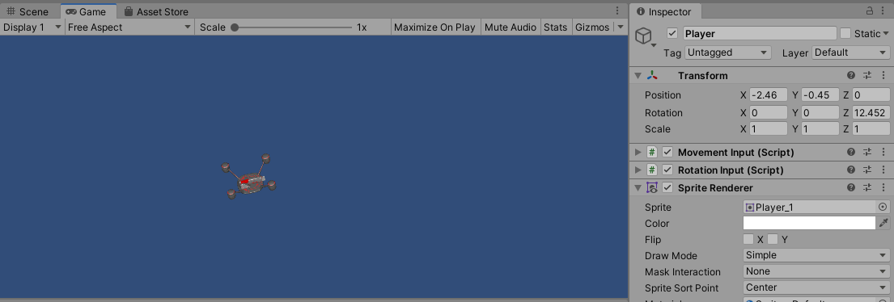

# Input dan Gerakan

Pada bagian kedua dari modul ini, kita akan membahas mengenai interaksi pemain dengan game melalui _input_ yang diberikan oleh pemain.
Serta bagaimana sistem akan merespon _input_ dari pemain tersebut, yang mana salah satunya adalah dengan menggerakkan objek yang dikendalikan oleh pemain.
Selain soal _input_ dan gerakan, pada bagian ini kita juga akan menyinggung beberapa hal lain yang akan membantu pengembangan game ini dari sisi _input_ dan gerakan seperti soal _public property_, _sprite_, dan lain sebagainya.

## Input

Salah satu keunggulan dari **Unity** adalah sifatnya yang _cross platform_.
Karena itu juga, **Unity** secara penuh mendukung berbagai macam jenis _input_ yang bisa digunakan seperti _keyboard_, _joystick_, _touch screen_, hingga _controller_ [_VR_](https://en.wikipedia.org/wiki/Virtual_reality) dan [_AR_](https://en.wikipedia.org/wiki/Augmented_reality).
Pada bagian ini, kita akan membahas lebih lanjut mengenai bagaimana _input_ di **Unity** bekerja, terutama soal _input_ yang menggunakan _keyboard_ dan _mouse_.

> Informasi lebih lanjut mengenai _input_ pada **Unity** bisa dilihat [disini](https://docs.unity3d.com/Manual/Input.html).

### Input Manager

Di **Unity**, _input_ secara umum akan diperlakukan sebagai _axis_, termasuk untuk _input_ yang seharusnya berupa _button_.
_Axis_ sendiri merupakan representasi _input_ yang memiliki dua arah yang saling berlawanan (negatif dan positif), biasanya digunakan sebagai input arah, seperti pada tombol _left_/_right_ atau _axis_ pada _joystick_.
Bagian yang mengatur _input_ pada **Unity** sendiri adalah **Input Manager** yang bisa diakses melalui menu `Edit` -> `Project Settings...` -> `Input Manager`.



Dengan adanya **Input Manager**, kita bisa mengatur berbagai macam _input_ dalam bentuk _axis_ yang dibutuhkan pada _game_ yang kita buat, seperti mengubah nama _axis_ maupun mengubah tombol yang mempengaruhi _axis_ tersebut.
Seperti pada contoh _default_, kita bisa mengetahui jika _axis_ `Horizontal` dipengaruhi oleh tombol _left_ dan _right_ sedangkan _axis_ `Vertical` dipengaruhi oleh tombol _down_ dan _up_.

> Informasi lebih lanjut mengenai **Input Manager** pada **Unity** bisa dilihat [disini](https://docs.unity3d.com/Manual/class-InputManager.html).

## Mengendalikan Pergerakan Objek Dengan Keyboard

Pada percobaan kali ini, kita akan membuat _component_ baru yang akan digunakan untuk mengendalikan pergerakan objek selama _game_ sedang berlangsung menggunakan _keyboard_.

### Membuat Component Movement Input

Buat **C#** _script_ baru dan beri nama `MovementInput`, kemudian buka **C#** _script_ tersebut dan ubah isi dari fungsi `Update()` sebagai berikut:

```c#
void Update()
{
    float inputX = Input.GetAxisRaw("Horizontal");
    float inputY = Input.GetAxisRaw("Vertical");

    Vector3 translation = new Vector3(inputX, inputY, 0);
    translation.Normalize();

    transform.Translate(translation * Time.deltaTime);
}
```

Penjelasan singkat dari baris _program_ diatas, _program_ akan mengambil nilai dari _axis_ `Horizontal` dan `Vertical` secara _raw_ menggunakan fungsi `GetAxisRaw()` dan kemudian menyimpannya ke dalam variabel `inputX` dan `inputY` secara berurutan.
Istilah _raw_ pada `GetAxisRaw()` sendiri menandakan bahwa input yang diberikan tidak akan mengalami _smoothing_.

> Sebagai catatan, `GetAxisRaw()` merupakan [_static method_](https://en.wikipedia.org/wiki/Method_(computer_programming)#Static_methods) dari _class_ `Input`, sehingga bisa dipanggil langsung tanpa perlunya instansi dari _class_ tersebut.
> Informasi lebih lanjut mengenai _class_ `Input` bisa dilihat [disini](https://docs.unity3d.com/ScriptReference/MonoBehaviour.html).

Kemudian dari kedua nilai _input_ yang didapatkan, dibentuklah `Vector3` baru yang kemudian di-[_normalize_](https://en.wikipedia.org/wiki/Unit_vector) agar gerakan _diagonal_ dari objek tidak lebih cepat dari gerakan yang lain.
Setelah itu, fungsi `Translate()` akan dipanggil menggunakan nilai `Vector3` yang sudah dibuat sebelumnya dikalikan dengan `Time.deltaTime`.

Setelah selesai, simpan baris _program_ tersebut.

### Menggunakan Component Movement Input

- Buka _scene_ `Game` yang sebelumnya sudah dibuat.
- Hapus _component_ `Random Start` dan `Up Movement` yang ada di _game object_ `Player`.

  

- Tambahkan _component_ `Movement Input` pada _game object_ `Player`.
- Klik tombol `Play` untuk melihat hasilnya.

  > Pada tahap ini, dengan menekan tombol _left_, _right_, _down_, maupun _up_ akan mengakibatkan objek bergerak sesuai dengan arah dari tombol tersebut.
  > Hal ini bisa terjadi karena di setiap _frame_, _component_ `Movement Input` akan melakukan translasi dari _game object_ sesuai dengan _axis_ dari _input_ yang diberikan oleh pemain.

## Public Property

Pada bagian sebelumnya, kita telah membuat _component_ `Movement Input` untuk menggerakkan objek yang kita inginkan.
Namun, gerakan dari _component_ yang telah kita buat terasa cukup lambat, dan kita juga tidak bisa mengatur kecepatan dari objek yang kita kendalikan sesuai dengan keinginan kita.
Oleh karena itu, **Unity** mengenal sebuah istilah yang bernama _public property_.
Secara umum, [_property_](https://en.wikipedia.org/wiki/Property_(programming)) sendiri digunakan untuk mendefiniskan variabel yang dimiliki oleh suatu _class_.
Dengan menjadikan suatu _property_ sebagai _public_, maka nilai dari _property_ tersebut bisa diubah secara langsung melalui **Inspector Window** tanpa perlu mengubahnya melalui **C#** _script_.

Buka kembali **C#** _script_ dari _component_ `Movement Input` dan ubah sebagai berikut:

```c#
public class MovementInput : MonoBehaviour
{
    public float speed = 1;

    ...

    void Update()
    {
        ...

        transform.Translate(translation * Time.deltaTime * speed);
    }
}
```

Penjelasan singkat dari baris _program_ diatas, nilai translasi sebelumnya dari _component_ `Movement Input` akan dikalikan dengan _public property_ `speed` yang secara _default_ bernilai `1`.
Nantinya, besar dari translasi (kecepatan dari objek) akan dipengaruhi oleh nilai dari _public property_ tersebut.

Setelah selesai, simpan baris _program_ tersebut.
Kemudian pada _component_ `Movement Input` akan terdapat _input field_ baru dengan nama `Speed`, nilai dari _input field_ tersebut bisa diubah sesuai dengan keinginan.
Hasilnya ketika _game_ sedang berlangsung, kecepatan dari _game object_ yang dikendalikan oleh pemain akan semakin lambat maupun semakin cepat sesuai dengan nilai `Speed` yang diberikan.


## Mengendalikan Perputaran Objek Dengan Mouse

Pada percobaan kali ini, kita akan membuat _component_ baru yang akan digunakan untuk mengendalikan perputaran objek berdasarkan posisi dari _mouse_ selama _game_ sedang berlangsung.

### Membuat Component Rotation Input

Buat **C#** _script_ baru dan beri nama `RotationInput`, kemudian buka **C#** _script_ tersebut dan ubah isi dari fungsi `Update()` sebagai berikut:

```C#
void Update()
{
    Vector3 mousePosition = Camera.main.ScreenToWorldPoint(Input.mousePosition);
    Vector3 mouseDirection = mousePosition - transform.position;

    float angle = Mathf.Atan2(mouseDirection.y, mouseDirection.x) * Mathf.Rad2Deg;

    transform.eulerAngles = new Vector3(0, 0, angle);
}
```

Penjelasan singkat dari baris _program_ diatas, inti dari _program_ tersebut adalah mengubah nilai _input_ dari posisi _mouse_ yang awalnya berdasarkan posisi _screen_ (_2D_) menjadi posisi _world_ (_3D_) dan menyimpannya ke dalam variabel `mousePosition`.
Kemudian dihitung selisih dari posisi _mouse_ dengan posisi dari objek dan disimpan dalam variabel `mouseDirection` dalam bentuk vektor.
Dari vektor tersebut, kemudian dihitung nilai dari sudut tersebut menggunakan perhitungan fungsi _atan2_ yang nantinya akan di-_set_ ke nilai `eulerAngles` (atau `Rotation`) dari _component_ `Transform`.

> [_Atan2_](https://en.wikipedia.org/wiki/Atan2), dikenal juga sebagai _2-argument arctangent_, merupakan fungsi yang digunakan untuk mendapatkan nilai sudut berdasarkan arah _x_ dan _y_.
> Berbeda dengan _atan_ yang hanya menghasilkan sudut 180 derajat, _atan2_ bisa digunakan untuk menghasilkan sudut hingga 360 derajat.

Setelah selesai, simpan baris _program_ tersebut.

### Menggunakan Component Rotation Input

- Buka _scene_ `Game` yang sebelumnya sudah dibuat.
- Pada _game object_ `Player`, tambahkan _component_ `Rotation Input`.
- Klik tombol `Play` untuk melihat hasilnya.

  > Pada tahap ini, objek akan selalu bergerak berputar menghadap ke posisi mouse.
  > Hal ini sesuai dengan perhitungan _atan2_ pada _component_ `Rotation Input` yang digunakan untuk mendapat sudut dari perputaran sehingga seolah-olah objek akan selalu menghadap ke arah posisi _mouse_.

## Sprite

Pada _game development_, istilah _sprite_ secara umum merujuk pada grafik _2D_, baik itu berupa grafik untuk _player_, _partikel_, animasi, tatap muka, dan lain sebagainya.
**Unity** sendiri sejak awal sudah mendukung istilah _sprite_ (dengan nama lain _texture_).
Walaupun awalnya **Unity** fokus pada pengembangan _3D_, tetapi grafik _2D_ secara umum sudah digunakan, terutama untuk _texture_ pada model _3d_ dan untuk grafik pada tatap muka.

> Informasi lebih lanjut mengenai _sprite_ pada **Unity** bisa dilihat [disini](https://docs.unity3d.com/Manual/Sprites.html).

### Menambahkan Sprite Pada Game Object

- Buka _scene_ `Game` yang sebelumnya sudah dibuat.
- Hapus _component_ `Mesh Filter`, `Mesh Renderer`, dan `Box Collider`.

  > Ketiga _component_ tersebut digunakan untuk menampilkan dan mengatur [_bounding box_](https://en.wikipedia.org/wiki/Bounding_volume) dari model _3D_.
  > Karena kita akan menggunakan _sprite_ yang basisnya _2D_, maka ketiga _component_ tersebut tidak akan digunakan.

- Pada _game object_ `Player`, tambahkan _component_ `Sprite Renderer` dan pada _input field_ `Sprite` tambahkan _sprite_ `Player_1`.

  > Pastikan anda sudah mereset `Scale` dari _component_ `Transform` menjadi `1`, `1`, `1` agar _sprite_ yang ditampilkan memiliki ukuran yang sesuai

- Klik tombol `Play` untuk melihat hasilnya.

  

  > Pada tahap ini, objek akan berfungsi sama seperti sebelumnya, hanya saja dengan tampilan yang lebih menarik karena alih-alih menggunakan model _3D_ yang tampak seperti persegi polos, disini kita menggunakan grafik _2D_ yang lebih sesuai denga _game_ yang akan kita buat.

## Mengatur Sprite Untuk Rotasi

Jika kita lihat, _sprite_ `Player` yang kita gunakan sebelumnya terdapat pada _folder_ `Sprites`.
Bentuk dari _sprite_ `Player` sendiri awalnya bukan _sprite_ satuan, tetapi dalam bentuk [_spritesheet_](https://en.wikipedia.org/wiki/Texture_atlas) yang terdiri dari berbagai macam _sprite_ (disini setiap _sprite_ merepresentasikan arah hadap dari karakter _player_).


Jika kita klik tombol panah lingkaran maka akan terlihat isi dari _spritesheet_ tersebut yang sudah terbagi menjadi beberapa _sprite_ dari `Player_0` sampai `Player_7`.


> Secara _default_, setiap grafik pada **Unity** akan diperlakukan sebagai _sprite_ tunggal.
> Untuk menjadikan suatu grafik sebagai _spritesheet_ dan membaginya menjadi beberapa _sprite_ maka dibutuhkan cara tersendiri menggunakan **Sprite Editor**.
> Informasi lebih lanjut mengenai penggunaan **Sprite Editor** bisa dilihat [disini](https://docs.unity3d.com/Manual/SpriteEditor.html).

Masalah dari _program_ sebelumnya adalah alih-alih mengganti _sprite_ untuk menampilkan arah hadap dari karakter _player_, _program_ malah merubah rotasi dari keseluruhan _sprite_.
Untuk itu disini kita akan mengatasi masalah itu dengan _component_ `Sprite Rotation` yang sudah ada pada _asset_ dan siap untuk digunakan.

### Menggunakan Component Sprite Rotation

- `Sprite Rotation` merupakan _component_ yang berfungsi mengubah tampilan _sprite_ dari _game object_ sesuai dengan nilai rotasi yang diberikan.

  > `Sprite Rotation` merupakan _component_ yang sudah jadi, detail dari cara kerja _component_ tersebut bisa dilihat sendiri pada **C#** _script_ `SpriteRotation`.

- Buka _scene_ `Game` dan pada _game object_ `Player`, tambahkan _component_ `Sprite Rotation`.
- Pada **Insepctor Window** Atur `Size` dari `Sprites` sebanyak `8` dan isi keseluruhan _element_ dengan _sprite_ `Player` dari `Player_0` sampai `Player_7` serta atur `Start Direction` menjadi `-45`.

  

  > Untuk mempermudah, setiap _sprite_ bisa di _drag and drop_ secara langsung dari folder `Sprites` ke _component_ `Sprite Rotation`.

- Untuk percobaan kali ini, kita akan men-_disable_ sementara _component_ `Rotation Input` dengan cara meng-_uncheck_ tombol disebelah nama _component_.

  

- Klik tombol `Play` untuk melihat hasilnya.

  

  > Pada tahap ini, mengubah nilai `Rotation` pada **Inspector Window** akan secara otomatis mengubah tampilan dari _sprite_ sesuai dengan indeks dari _sprite_ yang sebelumnya kita tambahkan pada `Sprites`.

### Menghubungkan Component Sprite Rotation dengan Rotation Input

Sebelumnya kita sudah memahami kegunaan dari _component_ `Sprite Rotation`.
Kali ini kita akan menghubungkannya dengan _component_ `Rotation Input` sehingga alih-alih mengubah rotasi dari _component_ Transform, _component_ `Rotation Input` akan mengubah nilai `Rotation` dari _component_ `Sprite Rotation`.

Buka kembali **C#** _script_ dari _component_ `Rotation Input` dan ubah sebagai berikut:

```c#
SpriteRotation spriteRotation;

void Start()
{
  spriteRotation = GetComponent<SpriteRotation>();
}

void Update()
{
    ...

    // transform.eulerAngles = new Vector3(0, 0, angle);

    if (spriteRotation != null) {
        spriteRotation.rotation = angle;
    }
}
```

Penjelasan singkat dari baris _program_ diatas, _program_ akan mengambil referensi dari _component_ `Sprite Rotation` dan menyimpannya ke variabel `spriteRotation`.
Ketika _update_, _program_ akan mengecek jika _component_ `Sprite Rotation` ada (tidak `null`, untuk menghindari [_runtime error_](https://en.wikipedia.org/wiki/Runtime_(program_lifecycle_phase))) dan jika ada, _program_ akan mengubah nilai `rotation` dari _component_ tersebut dengan nilai `angle` dari perhitungan sebelumnya.

> `GetComponent<T>()` merupakan salah satu _method_ yang ada di _class_ `MonoBehavior` ([_parent class_](https://en.wikipedia.org/wiki/Inheritance_(object-oriented_programming)) dari _class_ `RotationInput`).
> _Method_ ini memiliki kegunaan untuk mengambil referensi _class_ dari _component_ yang ada pada suatu _game object_.
> Informasi lebih lanjut dari _method_ `GetComponent<T>()` bisa dilihat [disini](https://docs.unity3d.com/ScriptReference/Component.GetComponent.html).

Setelah selesai, simpan baris _program_ tersebut dan coba jalankan kembali _game_ untuk melihat hasilnya.
Pada tahap ini, ketika _mouse_ digerakkan, _sprite_ dari objek `Player` akan berubah menghadap ke arah _mouse_ sesuai dengan perilaku `SpriteRotation` dan `RotationInput` yang ada sebelumnya.

> Pastikan _component_ `RotationInput` sudah di-_set_ kembali sebagai _enable_ agar _component_ bekerja.

## Kesimpulan

Dari bagian kedua ini kita telah mengenal bagaimana cara untuk membuat _component_ yang dapat digunakan untuk  memanipulasi objek menggunakan _input_ yang tersedia.
Selain itu kita juga mempelajari beberapa konsep tambahan dari **Unity** seperti kegunaan _public property_ yang bisa digunakan untuk mengubah variabel secara langsung pada **Inspector Window* tanpa mengubah _program_ serta menggunakan _sprite_ untuk mempercantik tampilan dari _game object_.

Pada bagian selanjutnya kita akan membahas lebih lanjut mengenai _spawn_ yang bisa digunakan untuk menambahkan _game object_ secara otomatis selama _game_ sedang berlangsung dan _collision_ yang nantinya digunakan untuk mengatur interaksi dari satu objek dengan objek lain ketika bertemu.

[Lanjut bagian ketiga, _Spawn_ dan _Collision_](../3-spawn-dan-collision/README.md)