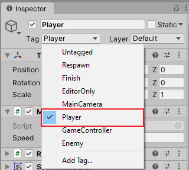
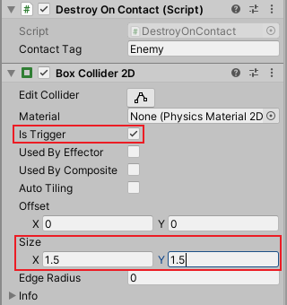

# Spawn dan Collision

Pada bagian ketiga ini, kita akan membahas mengenai cara [_spawning_](https://en.wikipedia.org/wiki/Spawning_(video_games)) objek baru ketika _game_ sedang berlangsung.
Serta cara membuat interaksi antara satu objek dengan objek lain ketika bertemuan menggunakan sistem [_collision_](https://en.wikipedia.org/wiki/Collision_detection) yang sudah ada pada **Unity**.
Selain kedua hal itu, kita akan mengenal beberapa konsep baru yang ada pada **Unity** seperti _prefab_, _physics_, dan lain sebagainya.

## Prefab

Di **Unity**, umumnya _game object_ selalu dikaitkan dengan suatu _scene_, seperti yang dijelaskan pada bagian pertama, dimana _scene_ dapat tersusun dari beberapa _game object_.
Namun, suatu _game object_ bisa dibentuk menjadi sebuah _asset_, sehingga tersimpan diluar _scene_, dan dapat digunakan di _scene_ manapun tanpa perlu membuat ulang _game object_ tersebut dan menyusun _component_-nya lagi di _scene_ baru.
_Game object_ yang berbentuk _asset_ ini secara umum dikenal sebagai _prefab_.
Salah satu kegunaan dari _prefab_, selain yang dijelaskan sebelumnya adalah sebagai _template_ _game object_ yang nantinya bisa digunakan dalam _spawning_.

> Informasi lebih lanjut mengenai _prefab_ pada **Unity** bisa dilihat [disini](https://docs.unity3d.com/Manual/Prefabs.html).

### Prefab Enemy

- Salah satu contoh dari _prefabs_ yang sudah kita sediakan adalah _prefab_ dari _game object_ `Enemy`.
  _Prefab_ ini nantinya akan digunakan untuk memunculkan objek `Enemy` secara otomatis selama _game_ sedang berlangsung.
- Buka _prefab_ `Enemy` yang ada di folder `Prefabs` dengan cara _double_ klik.

  > Sebagai catatan, sama seperti _asset_ yang lain, umumnya asset berbentuk _prefab_ juga diletakkan di _folder_ tersendiri yang bernama `Prefabs`.

- Tambahkan _component_ `Random Start` dan `Up Movement`.
  Isi `Speed` dengan nilai bebas.

  

  > Jika diperhatikan, kita menggunakan _component_ yang sama dengan yang sebelumnya kita buat pada bagian pertama.
  > Hal ini sesuai dengan prinsip dari _component based architecture_, dimana kita tidak perlu menulis ulang setiap _program_ yang memiliki kegunaan sama, cukup membagi _program_ menjadi potongan potongan kecil sehingga nantinya dengan mudah bisa digunakan untuk hal lain.

- Kemudian _drag and drop_ _prefab_ tersebut ke dalam _scene_ `Game`.

  > Sebagai kebalikan, jika _game object_ dilakukan _drag and drop_ dari _scene_ ke **Project Window** maka _game object_ tersebut secara otomatis akan berubah menjadi _prefab_.

- Klik tombol `PLay` untuk melihat hasilnya.

  

  > Pada tahap ini, perilaku dari _game object_ `Enemy` akan sesuai dengan yang ada pada bagian pertama dimana objek akan berpindah tempat secara acak di awal sambil bergerak ke atas.

  > Jika dilihat dengan teliti, _game object_ `Enemy` yang dibuat sebelumnya akan secara _otomatis_ menghilang ketika keluar dari pandangan.
  > Hal ini disebabkan oleh _component_ `Destroy On Disappear` yang sebelumnya sudah disematkan pada _prefab_ dari _game object_ `Enemy` tersebut.

## Object Spawning

Dalam _game development_, _object spawning_ mengacu pada istilah pembuatan suatu objek baru ketika _game_ sedang berlangsung.
Di **Unity** sendiri _object spawning_ bisa dilakukan dengan cara memanggil _method_ `Instantiate()` menggunakan template dari suatu objek yang bisa berupa _game object_ maupun _prefab_.

> Informasi lebih lanjut mengenai _method_ `Instantiate()` bisa dilihat [disini](https://docs.unity3d.com/ScriptReference/Object.Instantiate.html).

### Component Spawner

Pada percobaan kali ini, kita akan membuat _component_ baru yang akan digunakan untuk melakukan _spawning_ dari suatu objek dalam _interval_ tertentu.
Untuk itu, pertama, buat **C#** _script_ baru dengan nama `Spawner`.

Buka **C#** _script_ tersebut dan ubah isi dari _class_ `Spawner` sebagai berikut:

```c#
public class Spawner : MonoBehaviour
{
    public GameObject prefab;
    public float spawnInterval = 1;

    float time = 0;

    void Update()
    {
        time += Time.deltaTime;
        if (time >= spawnInterval) {
            time -= spawnInterval;

            if (prefab != null) {
                Instantiate(prefab, transform.position, transform.rotation);
            }
        }
    }
}
```

Penjelasan singkat dari baris _program_ diatas, _program_ tersebut akan menambah nilai dari variabel `time` sebesar `Time.deltaTime`.
Baris _program_ seperti diatas secara umum digunakan di **Unity** sebagai _timer_ sederhana yang akan memanggil fungsi yang ada di dalam blok `if` jika waktunya sudah terpenuhi (dalam hal ini yang dimaksud dengan waktu adalah waktu dari `spawnInterval`).

Kemudian _program_ akan menge-_check_ jika variabel `prefab` ada (kembali untuk menghindari _runtime error_), dan memanggil _method_ `Instantiate()` menggunakan _parameter_ `prefab` yang nantinya diset di **Inspector Window** dan _parameter_ posisi serta rotasi dari objek yang memanggil _method_ `Instantiate()` itu sendiri._

### Menggunakan Component Spawner

- Buka _scene_ `Game` yang sebelumnya sudah dibuat.
- Buat _game object_ baru dengan bentuk _empty_ (`Create Empty`) dan beri nama `Enemy Spawner`.
- Posisikan _game object_ tersebut ke bagian paling bawah dari _scene_, diluar tampilan _viewport_.

  

- Tambahkan _component_ `Spawner` yang sebelumnya sudah dibuat.
  Isi `Prefab` dengan _prefab_ dari `Enemy`, sedangakn `Spawn Interval` isi dengan nilai bebas.

  

- Klik tombol `Play` untuk melihat hasilnya.

  > Pada tahap ini, objek `Enemy` akan secara _otomatis_ muncul terus menerus dalam _interval_ waktu yang sudah ditentukan.

## Physics

Kebanyakan _game_ yang ada saat ini, baik itu yang berbentuk _3D_ maupun _2D_ sudah menerapkan [_physics_](https://en.wikipedia.org/wiki/Game_physics) dalam _game_ yang dibuat.
Jadi untuk pergerakan dari objek pada _game_ tidak hanya dilakukan dengan mengubah nilai dari transformasi secara _linear_, namun juga dengan menerapkan prinsip fisika seperti [_inertia_](https://en.wikipedia.org/wiki/Inertia), gravitasi, dan lain sebagainya.

> Informasi lebih lanjut mengenai _physics_ pada **Unity** bisa dilihat [disini](https://docs.unity3d.com/Manual/PhysicsSection.html).

### Component Rigidbody 2D

Secara sederhana, _rigidbody_ pada **Unity** merupakan istilah yang digunakan untuk menunjukkan objek yang akan dipengaruhi oleh _physics_.
Di **Unity** sendiri terdapat perbedaan antara _physics_ untuk _game_ _3D_ dengan _2D_.
Oleh karena itu terdapat dua macam bentuk _component_ dari _rigidbody_, yakni `Rigidbody` untuk _game_ _3D_ dan `Rigidbody 2D` untuk _game_ _2d_.
Karena _game_ yang kita buat merupakan _game_ _2D_, disini kita akan menggunakan _rigidbody_ menggunakan _component_ `Rigidbody 2D`.

> Informasi lebih lanjut mengenai _component_ `Rigidbody 2D` bisa dilihat [disini](https://docs.unity3d.com/ScriptReference/Rigidbody2D.html).

### Mengganti Pergerakan Transform Dengan Rigidbody 2D

Sebelumnya kita sudah membuat _component_ `Movement Input` dan `Up Movement` yang digunakan untuk menggerakkan objek dengan mengubah transformasi.
Kali ini kita akan mengubah isi dari kedua _component_ tersebut sehingga alih-alih menggunakan transformasi sederhana, pergerakan dari _game object_ akan dipengaruhi oleh _physics_ untuk mendapatkan hasil yang lebih baik.

Buka **C#** _script_ dari _component_ `Movement Input` dan ubah isi dari _class_ `MovementInput` sebagai berikut:

```c#
public class MovementInput : MonoBehaviour
{
    ...

    Rigidbody2D rigidbody2d;

    void Start()
    {
        rigidbody2d = GetComponent<Rigidbody2D>();
    }

    // void Update()
    void FixedUpdate()
    {
        ...

        // Vector3 translation = new Vector3(inputX, inputY, 0);
        Vector2 translation = new Vector2(inputX, inputY);

        ...

        // transform.Translate(translation * Time.deltaTime * speed);

        if (rigidbody2d != null) {
            rigidbody2d.velocity = translation * Time.deltaTime * speed;
        }
    }
}
```

Penjelasan singkat dari baris _program_ diatas, _program_ akan menyimpan referensi dari _component_ `Rigidbody 2D` karena berbeda dengan _component_ `Transform`, secara _default_ referensi dari _component_ `Rigidbody 2D` tidak disimpan pada _class_ `MonoBehaviour`.
Lalu fungsi `Update()` harus diganti dengan `FixedUpdate()` karena perhitungan yang dipengaruhi oleh _physics_ pada **Unity** harus ditaruh disana.
Kemudian kita harus mengganti bentuk dari variabel `translation` menjadi `Vector2` karena `Rigidbody 2D` hanya bisa berkerja dengan perhitungan `2D`.
Dan terakhir, alih-alih melakukan translasi pada _component_ `Transform`, program akan mengubah nilai `velocity` dari `rigidbody2d` menggunakan perhitungan yang sama.

Setelah selesai, simpan baris _program_ tersebut.
Kemudian buka **C#** _script_ dari _component_ `Up Movement` dan ubah isi dari _class_ `UpMovement` sebagai berikut:

``` c#
public class UpMovement : MonoBehaviour
{
    public float speed = 1;
    Rigidbody2D rigidbody2d;

    void Start()
    {
      rigidbody2d = GetComponent<Rigidbody2D>();
    }

    // void Update()
    void FixedUpdate()
    {
        // Vector3 translation = new Vector3(0, 5, 0);
        // transform.Translate(translation * Time.deltaTime);

        if (rigidbody2d != null) {
            rigidbody2d.velocity = Vector2.up * Time.deltaTime * speed;
        }
    }
}
```

Penjelasan singkat dari baris _program_ diatas, _program_ memiliki kesamaan dengan _program_ dari _component_ `Movement Input` seperti yang sudah dijelaskan sebelumnya.
Selain itu, _program_ juga mulai menggunakan _public property_ sehingga nantinya kecepatan dari objek bisa diatur lebih mudah pada **Inspector Window** seperti yang dijelaskan pada bagian kedua.

> Sebagai tambahan, `Vector2.up` merupakan salah satu _member variabel_ dari _class_ `Vector2` yang memiliki nilai yang sama dengan `new Vector2(0, 1)`.
> Informasi lebih lanjut mengenai _class_ `Vector2` bisa dilihat [disini](https://docs.unity3d.com/ScriptReference/Vector2.html).

Setelah selesai, simpan baris _program_ tersebut.

### Menggunakan Rigidbody

- Buka _game object_ `Player` pada _scene_ `Game`.
- Tambahkan _component_ `Rigidbody 2D`, _set_ `Gravity Scale` menjadi `0`, dan _set_ `Freeze Rotation` pada bagian `Constraints` menjadi _enable_.

  

  > `Gravity Scale` di-_set_ menjadi `0` agar objek tidak dipengaruhi gravitasi yang nantinya bisa menyebabkan objek bergerak ke bawah.
  > Sedangkan `Freeze Rotation` di-_enable_ agar objek tidak berputar secara tidak disengaja karena pengaruh _physics_ dari _rigidbody_ yang lain.

- Lakukan hal yang sama seperti diatas pada _prefab_ `Enemy`.

  > Pergerakan menggunakan `Rigidbody 2D` memiliki kecepatan gerak yang berbeda dibandingkan ketika menggunakan `Transform`.
  > Agar objek yang digerakkan tidak bergerak lambat, atur ulang nilai dari `Speed` pada _component_ `Movement Input` dan `UpMovement` dengan nilai yang lebih besar.

- Klik tombol `Play` untuk melihat hasilnya.

  > Pada tahap ini, pengaruh dari penggunaan _rigidbody_ dibandingkan transformasi biasa tidak akan banyak kelihatan karena gerakan yang kita buat merupakan gerakan yang terbilang sederhana.
  > Namun penggunaan _rigidbody_ ini sendiri merupakan hal yang penting, terutama untuk memastikan _collision_ yang akan kita buat nantinya bisa bekerja secara benar.

## Tag

Sesuai dengan namanya, _tag_ merupakan istilah yang digunakan di **Unity** untuk memberi label pada suatu _game object_, sehingga kita bisa menggolongkan _game object_ menjadi beberapa jenis berdasarkan _tag_ yang diberikan.
Pada bahasan kali ini kita akan menggunakan _tag_ terutama untuk membedakan antara objek yang berjenis _player_ dengan _enemy_ yang nantinya akan digunakan lebih lanjut dalam bagian _collision_.

> Informasi lebih lanjut mengenai _tag_ pada **Unity** bisa dilihat [disini](https://docs.unity3d.com/Manual/Tags.html)

### Mengatur Tag

- Penambahan _tag_ baru bisa dilakukan pada **Project Settings**, sedangkan untuk mengatur _tag_ yang digunakan pada _game object_ bisa dilakukan pada **Inspector Window**.
- Buka `Project Settings` yang ada di _menu_ `Edit` -> `Project Settings...`.
- Pada bagian `Tags and Layers`, buka bagian `Tags`, klik tombol `+`.
- Tambahkan _tag_ baru dengan nama `Enemy`, lalu klik tombol `Save`.

  

- Buka _game object_ `Player` pada _scene_ `Game` dan set _tag_ dari _game object_ tersebut menjadi `Player`.

  

  > Sebagai informasi, _tag_ `Player` merupakan salah satu _tag_ yang secara _default_ sudah ada di **Unity** sehingga kita tidak perlu membuat _tag_ itu lagi.

- Buka _prefab_ `Enemy` dan set _tag_ dari _game object_ tersebut menjadi `Enemy`.

## Collider

_Collider_ pada **Unity** merupakan jenis _component_ yang memiliki kegunaan untuk mendeteksi sentuhan dari suatu objek dengan objek yang lain.
Secara umum terdapat dua bentuk _collider_ di **Unity**, yakni _collision_ itu sendiri dan _trigger_.
Perbedaannya terletak pada seberapa detail informasi yang diperlukan ketika dua objek saling bersentuhan.
Pada _trigger_ informasi yang diberikan hanya berupa objek yang disentuh, sedangkan pada _collision_ informasi yang diberikan akan lebih detail lagi seperti letak sentuhan, dan seberapa banyak objek yang bersentuhan.

> Informasi lebih lanjut mengenai _collider_ pada **Unity** bisa dilihat [disini](https://docs.unity3d.com/Manual/CollidersOverview.html)

### Membuat Component Destroy On Contact

Pada percobaan kali ini kita akan membuat _component_ baru yang digunakan untuk menghapus suatu objek jika objek tersebut bersentuhan dengan objek lain yang memiliki tag tertentu.
Untuk itu, pertama, buat **C#** _script_ baru dengan nama `DestroyOnContact`.

Buka **C#** _script_ tersebut dan ubah isi dari _class_ `DestroyOnContact` sebagai berikut:

```c#
public class DestroyOnContact : MonoBehaviour
{
    public string contactTag;

    void OnTriggerEnter2D(Collider2D other)
    {
        if (other.tag == contactTag)
        {
            Destroy(gameObject);
        }
    }
}
```

Penjelasan singkat dari baris program diatas, fungsi `OnTriggerEnter2D()` akan dipanggil jika suatu _collider_ bersentuhan dengan _collider_ yang lain.
Dan jika objek dari _collider_ tersebut memiliki _tag_ seperti yang ditentukan di `contactTag`, maka _program_ akan menghapus _game object_ itu sendiri.

> Sebagai catatan, `OnTriggerEnter2D()` merupakan salah satu bentuk fungsi [_event_ ](https://en.wikipedia.org/wiki/Event_(computing)) yang ada pada _class_ `MonoBehaviour`, sama seperti fungsi `Start()`, `Update()`, dan lain sebagainya.
> Informasi lebih lanjut mengenai fungsi _event_ yang ada pada `MonoBehavior` bisa dilihat [disini](https://docs.unity3d.com/ScriptReference/MonoBehaviour.html).

### Menggunakan Component Destroy On Contact

- Buka _game object_ `Player` pada _scene_ `Game`.
- Tambahkan _component_ `Destroy On Contact` dan set `Contact Tag` menjadi `Enemy`.
- Tambahkan _component_ `Box Collider 2D`, _set_ `Is Trigger` menjadi _enable_, dan atur ulang `Size` sehingga berukuran `1.5`, `1.5`.

  

  > Seperti yang dijelaskan sebelumnya, dengan meng-_enable_ `Is Trigger` mengakibatkan _collider_ bekerja sebagai _trigger_ dan bukan _collision_.

- Lakukan hal yang sama seperti diatas pada _prefab_ `Enemy`, namun dengan menge-_set_ `Contact Tag` menjadi `Player`.
- Klik tombol `Play` untuk melihat hasilnya.

> Pada tahap ini, ketika objek `Player` bersentuhan dengan objek `Enemy` maka kedua objek tersebut akan secara otomatis terhapus dari _game_.
> Hal ini sesuai dengan cara kerja dari _component_ `Destroy On Contact` seperti yang dijelaskan sebelumnya.

## Menembak Peluru

_Game_ yang sudah kita buat sudah berjalan cukup lancar, namun akan terasa membosankan jika tantangan yang ada hanyalah menghindari gerakan dari musuh.
Untuk itu kita akan menerapkan fitur baru yang ada pada _game_ yang kita buat sehingga kedua objek _player_ maupun _enemy_ memiliki kemampuan untuk menembakkan peluru.

> Sebagai catatan, untuk mempersingkat waktu, _component_ yang akan digunakan pada tahap ini sebelumnya sudah dibuat dan siap untuk digunakan.
> Detail dari cara kerja _component_ tersebut tidak akan dibahas disini, namun bisa ditanyakan di lain waktu.

### Component Enemy Behavior

- `Enemy Behavior` merupakan _component_ yang akan digunakan agar objek `Enemy` mampu membidik pemain dan menembakkan peluru ke arahnya.
- Pada _prefab_ `Enemy`, tambahkan _component_ `Enemy Behavior` dan atur `Bullet` menjadi _prefab_ `EnemyBullet` yang sudah ada serta atur `Shoot Interval` dengan nilai yang diinginkan.

  

- Pada _prefab_ `EnemyBullet`, ubah _tag_ dari _game object_ tersebut menjadi `EnemyBullet` dan tambahkan _component_ `Destroy On Contact` dengan `Contact Tag` berisi `Player`.

  

- Pada _game object_ `Player` di _scene_ `Game`, tambahkan lagi _component_ `Destroy On Contact` dengan `Contact Tag` berisi `EnemyBullet`.
- Klik tombol `Play` untuk melihat hasilnya.

  

  > Pada tahap ini, selama _game_ berlangsung, _game object_ `Enemy` akan menembakkan peluru ke arah _game object_ `Player`.
  > dan sesuai dengan _component_ `Destroy On Contact` yang ditambahkan, ketika peluru tersebut menyentuh pemain, maka kedua objek tersebut akan terhapus dari _game_.

### Component Shoot Input

- `Shoot Input` merupakan _component_ yang digunakan untuk menembakkan objek peluru ketika pemain memberikan _input_ klik menggunakan _mouse_.
- Pada _game object_ `Player` di _scene_ `Game`, tambahkan _component_ `Shoot Input` dan atur `Bullet` menjadi _prefab_ `PlayerBullet` yang sudah ada serta atur `Reload TIme` dengan nilai yang diinginkan.

  

- Pada _prefab_ `PlayerBullet`, ubah _tag_ dari _game object_ tersebut menjadi `PlayerBullet` dan tambahkan _component_ `Destroy On Contact` dengan `Contact Tag` berisi `Enemy`.

  

- Pada _prefab_ `Enemy`, tambahkan lagi _component_ `Destroy On Contact` dengan `Contact Tag` berisi `PlayerBullet`.
- Klik tombol `Play` untuk melihat hasilnya.

  

  > Pada tahap ini, selain musuh, pemain juga sudah bisa menembakkan peluru yang mana ketika bersentuhan dengan _game object_ `Enemy` akan menghapus kedua objek tersebut.

  > Sebagai tambahan, agar _game_ terasa menyenangkan, anda bisa secara bebas mengatur parameter yang ada mulai dari skala objek, kecepatan, _spawn interval_, dan lain sebagainya.

## Kesimpulan

Dari bagian ketiga ini kita telah membahas mengenai cara melakukan _object spawning_ ketika _game_ sedang berlangsung serta interaksi yang dapat dilakukan dari dua objek berbeda ketika keduanya bersentuhan.
Selain itu kita juga mengenal beberapa konsep baru di **Unity** seperti detail dari sistem **Physics** sebagai alternatif cara menggerakkan objek selain dengan cara transformasi serta beberapa konsep dasar seperti _prefab_ untuk menyimpan _game object_ sebagai asset dan _tag_ untuk menggolongkan _game object_ menjadi jenis tertentu.

Pada bagian selanjutnya kita akan mematangkan lagi game yang sudah kita buat dengan menambahkan _scene_ baru untuk keperluan _menu_, menambahkan tatap muka pada _game_, serta menerapkan sistem _score_ pada _game_ yang kita buat.

[Lanjut bagian keempat, Navigasi _Scene_](../4-navigasi-scene/README.md)
