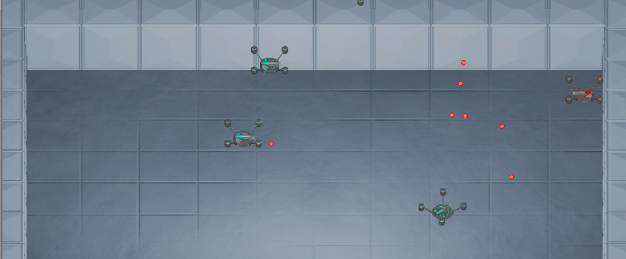
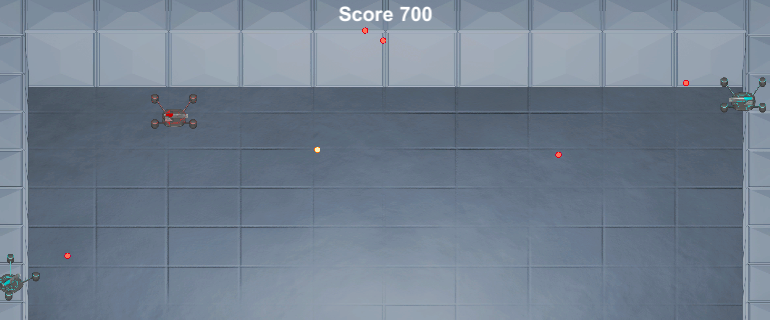
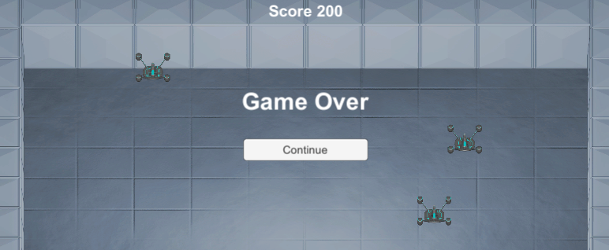

# Navigasi Scene

Pada bagian keempat dari modul ini, kita secara utama akan membahas mengenai cara melakukan perpindahan dari satu _scene_ ke _scene_ yang lainnya.
Selain itu pada tahap ini kita juga akan menyinggung beberapa hal lain yang akan digunakan untuk menyelesaikan _game_ yang sedang kita buat hingga sampai ke bentuk _final_ yang siap untuk digunakana.

## Background

Seperti yang kita lihat sebelumnya, _game_ yang sedang kita buat belum memiliki _background_ yang terlihat menyatu dengan jenis _game_ yang kita buat.
Selain itu pada pada _game_ yang kita buat, tidak ada batasan pada _scene_ sehingga _player_ bisa dengan bebas bergerak keluar _scene_.
Untuk mengatasi masalah tersebut, dan untuk mempersingkat waktu, kita sudah menyiapkan _prefab_ `Background` yang sebenarnya merupakan objek dengan _component_ `Sprite Renderer` untuk menampilkan _background_-nya serta 4 _component_ `Box Collider 2D` yang digunakan sebagai pembatas pada _scene_.


Selain itu terdapat juga _component_ `Scale To View` yang dibuat khusus untuk mengubah skala dari _game object_ sesuai dengan ukuran dari _viewport_ secara otomatis.
Hal ini dilakukan agar pada ukuran layar yang berbeda, tidak terdapat ruangan kosong maupun bagian yang terpotong pada _scene_ selama _game_ sedang berlangsung.

> Sebagai catatan, untuk mempersingkat waktu, _component_ `Scale to View` yang digunakan pada _prefab_ tersebut_ sebelumnya sudah dibuat dan siap untuk digunakan.
> Detail dari cara kerja _component_ tersebut tidak akan dibahas disini, namun bisa ditanyakan di lain waktu.

### Menambahkan Background Pada Scene

- Buka _scene_ `Game` yang sebelumnya sudah dibuat.
- _Drag and drop_ _prefab_ `Background` ke dalam _scene_ `Game`.

  

- Buka _game object_ `Player` yang ada di dalam _scene_ `Game`, dan Pada _component_ `Box Collider 2D`, _set_ nilai `Is Trigger` menjadi _disable_.

  

  > Salah satu kelemahan penggunaan `Is Trigger` adalah _collider_ tidak akan membatasi pergerakan dari _game object_ lain.
  > Untuk itu pada bagian ini, penggunaan `Is Trigger` di-_disable_ lagi agar nantinya pergerakan dari _game object_ `Player` bisa dibatasi oleh _game object_ `Background`.

- Buka _prefab_ `Enemy`, hapus _component_ `Random Start`, dan kemudian tambahkan _component_ `Random Start By Camera`.

  > _Component_ `Random Start By Camera` merupakan bentuk lain dari _component_ `Random Start`.
  > Namun, alih-alih mengubah posisi dengan nilai yang sudah ditentukan, _component_ ini akan mengubah posisi dengan nilai yang sesuai dengan panjang dari _viewport_.


  > Sebagai catatan, untuk mempersingkat waktu, _component_ `Random Start by Camera` yang akan digunakan pada tahap ini sebelumnya sudah dibuat dan siap untuk digunakan.
  > Detail dari cara kerja _component_ tersebut tidak akan dibahas disini, namun bisa ditanyakan di lain waktu.

- Klik tombol `Play` untuk melihat hasilnya.

  

  > Pada tahap ini, pergerakan dari objek `Player` akan dibatasi sesuai dengan _collider_ yang ada pada objek `Background`.
  > Namun pergerakan dari objek musuh maupun peluru tidak akan dibatasi karena kedua objek tersebut masih menggunakan _collider_ dengan `Is Trigger` yang di-_enable_, berbeda dengan objek `Player`.

## Canvas

_Canvas_ merupakan area dimana [_user interface_](https://en.wikipedia.org/wiki/User_interface) (_UI_) dari **Unity** diatur.
Pada **Unity** sendiri, sebuah objek yang berhubungan dengan _UI_ seperti _text_, _button_, _image_, dan lain sebagainya harus berada di bawah _hierarchy_ objek berjenis _canvas_.
Selain itu berbeda dengan _game object_ pada umumnya, objek berbentuk _UI_ memiliki transformasi tersendiri dalam bentuk `Rect Transform` dan bukan dalam bentuk `Transform`.

> Informasi lebih lanjut mengenai _canvas_ pada **Unity** bisa dilihat [disini](https://docs.unity3d.com/2020.1/Documentation/Manual/UICanvas.html).

### Membuat Canvas dan Menambahkan Text

- Pada percobaan kali ini kita akan membuat _canvas_ yang nantinya digunakan sebagai _UI_ untuk menampilkan _score_ dari _game_.
- Buka _scene_ `Game` yang sebelumnya sudah dibuat.
- Tambahkan _game object_ baru dengan jenis `UI` -> `Canvas` dan ubah namanya menjadi `Score Canvas`.

  

  > Pada tahap ini, akan muncul dua _game object_ baru yakni `Canvas` dan `EventSystem`.
  > `Event System` sendiri merupakan _game object_ yang secara default digunakan sebagai pendamping _canvas_ pada **Unity**, terutama untuk mengatasi hal yang berhubungan dengan _input_ pada _UI_.

- Klik kanan pada _game object_ `Score Canvas` di **Hierarchy Window**, tambahkan _game object_ baru dengan jenis `UI` -> `Text`, dan ubah namanya menjadi `Score Text`.
- Atur transformasi dan bentuk tulisan dari `Score Text` sesuai dengan keinginan.

  > Ubah _component_ `Rect Transform` untuk mengatur transformasi dari _UI_ dan ubah _component_ `Text` untuk mengatur tampilan tulisan dari _UI_.

### Component Score Manager dan Score Display

Pada tahap sebelumnya, kita sudah membuat _UI_ yang digunakan untuk menampilkan _score_ dari _game_, namun _UI_ tersebut tidak akan memiliki arti tanpanya _program_ yang mengatur isi teks dari _UI_ tersebut.
Untuk itu pada tahap ini, kita akan membuat _component_ `Score Manager` yang digunakan untuk mengatur nilai dari _score_ dan _component_ `Score Display` yang digunakan untuk menampilkan _score_ tersebut ke dalam _UI_.

Untuk itu buat **C#** _script_ baru dengan nama `ScoreManager`, buka, dan ubah isi dari _class_ `ScoreManager` sebagai berikut:

```c#
public class ScoreManager : MonoBehaviour
{
    public static int score = 0;

    void Start()
    {
        score = 0;
    }
}
```

Penjelasan singkat dari baris _program_ diatas, _program_ akan menyimpan sebuah variabel `score` yang berjenis _static_ dan Kemudian ketika `Start()`, nilai dari _score_ tersebut akan di-_set_ menjadi `0`.
Seperti yang pernah dijelaskan sebelumnya, variabel _static_ digunakan untuk mengakses nilai dari suatu _class_ tanpa perlunya instansi dari _class_ tersebut, jadi bisa dibilang berapa banyakpun _component_ `Score Manager` yang ada, variabel `score` akan selalu mereferensi nilai yang sama.

Setelah selesai, simpan baris _program_ diatas.
Kemudian buat **C#** _script_ baru dengan nama `ScoreDisplay`, buka, dan ubah isinya sebagai berikut:

```c#
...

using UnityEngine.UI;

public class ScoreDisplay : MonoBehaviour
{
    Text text;

    void Start()
    {
        text = GetComponent<Text>();
    }

    void Update()
    {
        if (text) {
            text.text = "Score " + ScoreManager.score;
        }
    }
}
```

Penjelasan singkat dari baris program diatas, _program_ akan menggunakan namespace tambahan berupa `UnityEngine.UI`, hal ini karena kita akan mengatur hal yang berhubungan dengan _UI_, yakni pada _component_ `Text`.
Baris selanjutnya di dalam _class_ `ScoreDisplay` menjelaskan bentuk yang secara biasa kita gunakan untuk mengambil referensi _class_ dari suatu _component_.
Dan terakhir pada fungsi `Update()`, jika _component_ `Text` tersebut ada, maka kita akan menge-_set_ nilai dari `text` menjadi _string_ yang berbentuk `"Score " + ScoreManager.score`.

> Informasi lebih lanjut mengenai _class_ `Text` yang ada di `UnityEngine.UI` bisa dilihat [disini](https://docs.unity3d.com/2019.1/Documentation/ScriptReference/UI.Text.html)

Setelah selesai, simpan baris _program_ diatas.

### Menggunakan Component Score Manager dan Score Display

- Buka _scene_ `Game` yang sebelumnya sudah dibuat.
- Tambahkan _game object_ baru dengan jenis _empty_, beri nama `Score Manager`, dan tambahkan _component_ `Score Manager`.
- Pada _UI_ `Score Text` yang sudah dibuat sebelumnya, tambahkan _component_ `Score Display`.
- Klik tombol `Play` untuk melihat hasilnya.

  

  > Pada tahap ini, _UI_ dari `Score Text` akan tampak pada layar, dan isi teks dari _UI_ tersebut akan menjadi `Score 0`.
  > Hal ini sesuai dengan baris _program_ yang kita buat pada _component_ `Score Display`, terutama di bagian yang menge-_set_ nilai dari `text` pada menjadi `"Score " + ScoreManager.score`.

### Menambah Score Saat Menembak Musuh

Pada tahap sebelumnya kita sudah mencoba menampilkan _score_ dalam bentuk _UI_, namun nilai dari _score_ tersebut tidak akan berubah karena belum ada hal yang mempengaruhi nilai dari score tersebut.
Untuk itu, pada tahap ini kita akan mengubah _component_ `Destroy On Contact` agar bisa menambahkan nilai dari _score_ untuk setiap musuh yang berhasil ditembak oleh pemain.

Buka **C#** _script_ dari _component_ `Destroy On Contact` dan ubah isi dari _class_ `Destroy On Contact` sebagai berikut:

```c#
public class DestroyOnContact : MonoBehaviour
{
    ...

    public int bonusScore = 0;

    void OnTriggerEnter2D(Collider2D other)
    {
        if (other.tag == contactTag)
        {
            ...

            ScoreManager.score += bonusScore;
        }
    }
}
```

Penjelasan singkat dari baris _program_ diatas, _program_ akan menambah nilai dari `score` yang ada pada _class_ `ScoreManager` sebesar `bonusScore`.
Dengan kata lain, ketika bersentuhan dengan objek lain dengan _tag_ yang sudah ditentukan, _component_ ini selain menghancurkan _objek_ itu sendiri juga akan menambahkan nilai _score_ sebanyak nilai yang ada pada `bonusScore`.

Setelah selesai, simpan baris _program_ diatas.
Kemudian buka _prefab_ `Enemy` dan atur nilai `Bonus Score` dari _component_ `Destroy On Contact` yang berhubungan dengan peluru pemain.
Atur nilainya sesuai keinginan, dan klik tombol `Play` untuk melihat hasilnya.



> Pada tahap ini, sesuai dengan baris _program_ yang sudah diubah, _score_ akan bertambah untuk setiap peluru dari pemain yang mengenai objek musuh.

## Navigasi Scene

Sebelumnya, kita sudah mempersiapkan _scene_ utama dari permainan untuk _game_ yang kita buat.
Namun sebuah game akan terasa kurang pas jika tidak memiliki _scene_ tambahan untuk _menu_-nya.
Oleh karena itu pada bagian ini kita akan mencoba menggunakan _scene_ tambahan untuk _menu_ dan mengaturnya sehingga bisa berpindah ke _scene_ `Game` yang sebelumnya sudah kita buat.

### Scene Menu

_Scene_ `Menu` yang akan kita gunakan pada tahap ini bisa dilihat di dalam _folder_ `Scenes`.
Isi dari _scene_ ini sendiri secara umum hanyal _UI_ tanpa adanya _game object_ bergerak seperti pada _scene_ `Game`.
Pada _scene_ ini terdapat objek `Background` yang merupakan _UI_ berbentuk `Image`, serta `Title Text` dan `High Score Text` merupakan _UI_ dengan bentuk `Text`.


> Sebagai catatan, untuk mempersingkat waktu, _scene_ `Menu` yang digunakan pada tahap ini sebelumnya sudah dibuat dan siap untuk digunakan.
> Detail dari pembuatan _scene_ tersebut tidak akan dibahas disini, namun bisa ditanyakan di lain waktu.

Selain itu ada juga objek `Start Button` dan `Exit Button` yang berbentuk `Button`.
`Exit Button` sendiri sudah memiliki fungsi penuh untuk mengeluarkan _game_ ketika ditekan, sesuai dengan fungsi dari _component_ `Exit Game`, sedangkan `Start Button` memiliki fungsi yang nantinya baru akan kita isi di bagian ini.

> Sebagai catatan, untuk mempersingkat waktu, _component_ `Exit Game` yang digunakan pada `Exit Button` ini sebelumnya sudah dibuat dan siap untuk digunakan.
> Detail dari pembuatan _component_ tersebut tidak akan dibahas disini, namun bisa ditanyakan di lain waktu.

### Component Scene Navigator

Pada tahap ini, kita akan membuat _component_ yang akan digunakan untuk melakukan perpindahan dari satu _scene_ ke _scene_ lain ketika fungsi yang ada di panggil.
Untuk itu, pertama, buat **C#** _script_ baru dengan nama `SceneNavigator`.

Buka **C#** tersebut, dan ubah isinya sebagai berikut:

```c#
...
using UnityEngine.SceneManagement;

public class SceneNavigator : MonoBehaviour
{
    public string sceneName;

    public void Execute()
    {
        SceneManager.LoadScene(sceneName);
    }
}
```

Penjelasan singkat dari baris _program_ diatas, _program_ akan menggunakan namespace tambahan berupa `UnityEngine.SceneManagement`, hal ini karena kita akan mengatur hal yang berhubungan dengan manajemen _scene_, yakni pada saat memanggil _method_ `LoadScene()` pada _class_ `SceneManager`.
_Method_ ini sendiri memiliki fungsi untuk membuka _scene_ baru dengan nama sesuai _parameter_ yang diberikan.

> Informasi lebih lanjut mengenai _method_ `LoadScene()` pada _class_ `SceneManager` bisa dilihat [disini](https://docs.unity3d.com/ScriptReference/SceneManagement.SceneManager.LoadScene.html).

### Menggunakan Component Scene Navigator

- Buka _scene_ `Menu` yang sebelumnya sudah ada.
- Buka objek `Start Button`, tambahkan _component_ `SceneNavigator` dan pada `Scene Name` atur menjadi `Game`.
- Pada _component_ `Button` dari objek `Start Button`, di bagian `On Click ()`, tambahkan _list_ baru (tombol `+`), pilih objek `Start Button` itu sendiri, dan untuk fungsi yang digunakan pilih `SceneNavigator.Execute`.

  

- Klik tombol `Play` untuk melihat hasilnya.

  > Pada tahap ini, ketika tombol `Start` diklik maka _scene_ secara otomatis akan berpindah ke _scene_ `Game`.
  > Sesuai dengan program yang sebelumnya dibuat pada _component_ `Scene Navigator`.

## Game Over

Terakhir, agar _loop_ selalu berjalan, maka selain perpindahan dari _scene_ `Menu` ke _scene_ `Game`, juga perlu adanya perpindahan lagi dari _scene_ `Game` ke _scene_ `Menu`.
Pada _game_ yang akan kita buat ini, perpindahan _scene_ akan terjadi ketika objek dari pemain sudah hancur, atau dengan kata lain [_game over_](https://en.wikipedia.org/wiki/Game_over).

### Prefab Game Over Canvas

Untuk mempersingkat waktu, kami sudah menyiapkan objek yang nantinya digunakan untuk menampilkan pesan _game over_ dalam bentuk _prefab_ `Game Over Canvas` yang ada di _folder_ `Prefabs`.
_Prefabs_ ini merupakan objek _canvas_ yang terdiri dari objek berjenis `Text` yang menampilkan tulisan _game over_ serta objek berjenis `Button` yang digunakan untuk berpindah kembali ke menu utama.


Sebelum kita lanjut ke tahap berikutnya, perlu diketahui bahwa tombol `Continue` pada _prefab_ tersebut belum memiliki fungsi untuk berpindah _scene_ ketika ditekan.
Untuk itu perlu ditambahkan _component_ `Scene Navigator` serta mengatur `On Click` pada _component_ button sesuai dengan langkah yang sudah dilakukan di tahap sebelumnya.

### Menggunakan Component Spawn On Destroy

- Cara yang akan kita lakukan untuk menampilkan pesan _game over_ adalah dengan melakukan _spawning_ dari _prefab_ `Game Over Canvas` ketika _game object_ `Player` dihapus.
  Untuk mengatasi hal tersebut, kita bisa menggunakan _component_ `Spawn On Destroy`.

  > Sebagai catatan, untuk mempersingkat waktu, _component_ `Spawn On Destroy` yang digunakan pada tahap ini sebelumnya sudah dibuat dan siap untuk digunakan.
  > Detail dari pembuatan _component_ tersebut tidak akan dibahas disini, namun bisa ditanyakan di lain waktu.

- Buka _game object_ `Player` yang ada di _scene_ `Game`.
- Tambahkan _component_ `Spawn On Destroy` dan atur `Prefab` menjadi _prefab_ dari `Game Over Canvas`.

  

- Klik tombol `Play` untuk melihat hasilnya.

  

  > Pada tahap ini, ketika objek pemain terhapus, maka secara otomatis pesan _game over_ akan muncul dari layar, dan ketika tombol `Continue` ditekan maka _scene_ akan kembali berpindah ke _scene_ menu.

## Kesimpulan

Dari bagian keempat ini kita telah membahas banyak hal, terutama mengenai cara perpindahan _scene_ ke _scene_ yang lain.
Selain kita juga telah belajar beberapa hal lain seperti _UI_ yang ada di **Unity** dan bagaimana cara menggunakannya.

Dan selamat anda sudah sampai di bagian akhir dari _workshop_ kali ini.
Dari sini kita telah belajar banyak hal mengenai pembuatan _game_ menggunakan **Unity** dari pembahasan konsep yang paling dasar sampai _game_ selesai.
Untuk langkah selanjutnya yang bisa diambil adalah mengeksplorasi fungsi fungsi yang ada **Unity** itu sendiri secara mandiri.
Pikirkan sebuah game yang ingin dibuat, dan baca referensi mengenai **Unity** yang bisa dipelajari **Unity Manual** maupun tutorial mengenai pembuatan _game_ menggunakan **Unity** yang bisa dicari dengan mudah di _internet_.