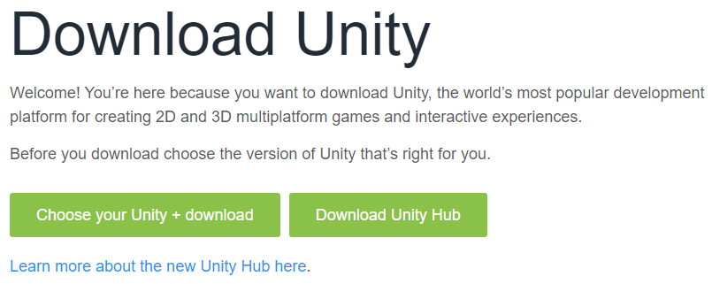
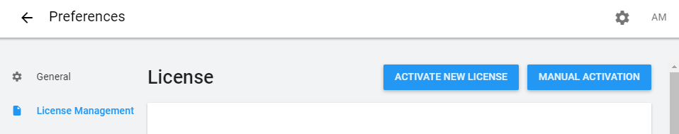
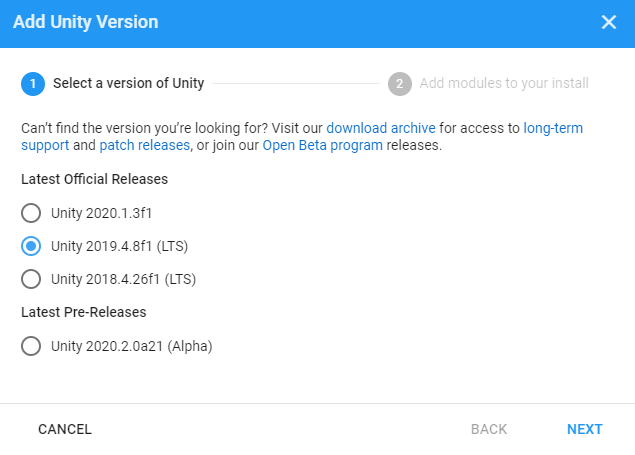
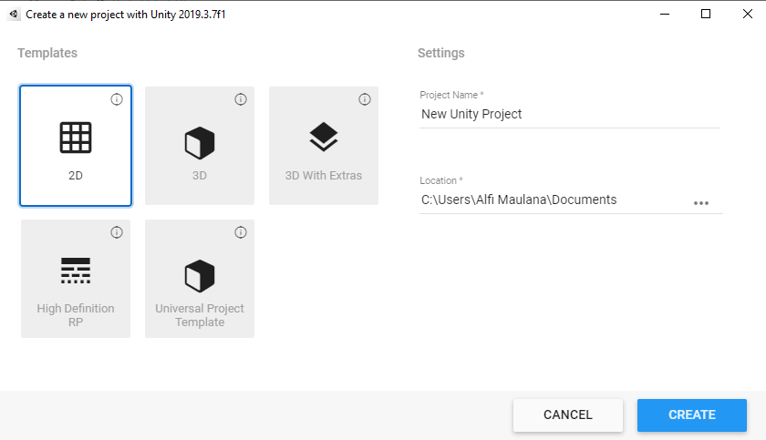
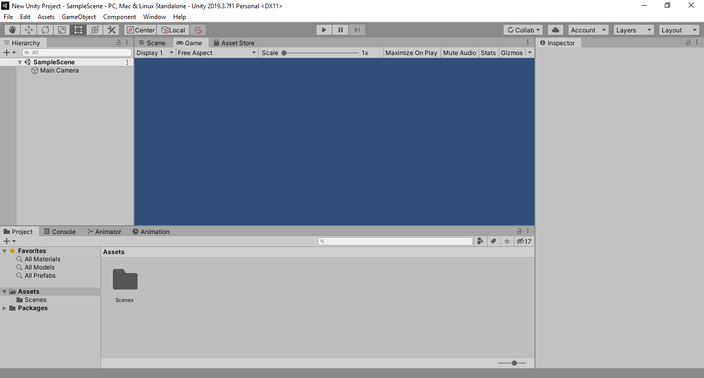
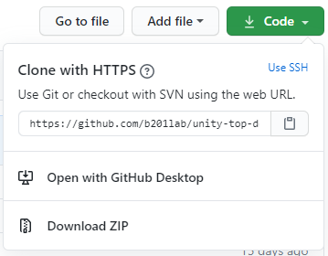
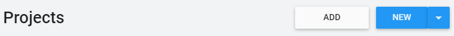

# Pembuatan Game Top Down Menggunakan Unity

[**Unity**](https://unity.com/) merupakan salah satu [_game engine_](https://en.wikipedia.org/wiki/Game_engine) yang dapat digunakan untuk membuat _game_ secara [_cross platform_](https://en.wikipedia.org/wiki/Cross-platform_software).
Dulunya _game engine_ ini dikenal juga sebagai **Unity 3D**, karena keunggulan utamanya terletak pada pembuatan _game_ berbasis _3D_.
Namun dengan seiringnya waktu, perkembangan _game engine_ ini juga mulai mendukung secara penuh untuk pembuatan game berbasis _2D_.
Selain itu, sesuai dengan namanya, **Unity**, _game engine_ ini mempunyai prinsip penyatuan, dengan adanya sistem _package manager_ serta [_component based architecture_](https://en.wikipedia.org/wiki/Component-based_software_engineering), pembuatan _game_ bisa berjalan lebih cepat dengan mengandalkan _package_ maupun _component_ yang sudah ada tanpa perlu menulis ulang fungsi untuk tiap _component_ yang dibutuhkan.

> Agar workshop pada _hari-h_ berjalan dengan lancar, setiap peserta diharapkan sudah melakukan instalasi **Unity** secara mandiri pada komputer masing masing

## Instalasi Unity

Berbeda dengan cara sebelumnya, untuk saat ini instalasi **Unity** diharuskan melewati program lain yang bernama [**Unity Hub**](https://docs.unity3d.com/Manual/GettingStartedUnityHub.html).
**Unity Hub** sendiri merupakan _program_ yang digunakan untuk mengatur akun dan lisensi **Unity** serta untuk melakukan instalasi **Unity Editor** pada versi yang berbeda-beda.
> Informasi lebih lanjut mengenai instalasi **Unity** bisa dilihat [disini](https://docs.unity3d.com/Manual/GettingStartedInstallingUnity.html).

### Instalasi Unity Hub

- Sebelum melakukan instalasi, pastikan spesifikasi komputer anda sudah memenuhi prasyarat minimum sehingga pembuatan _game_ menggunakan **Unity** nantinya bisa berjalan dengan lancar.
  > Informasi lebih lanjut mengenai spesifikasi minimum **Unity** bisa dilihat [disini](https://docs.unity3d.com/Manual/system-requirements.html).
- Unduh **Unity Hub** pada halaman berikut **https://unity3d.com/get-unity/download**.

  

- Buka _program_ yang sudah diunduh untuk melakukan instalasi **Unity Hub**.

### Instalasi Unity Editor

- Buka **Unity Hub**.
- Sebelum melakukan instalasi **Unity Editor**, anda akan diminta untuk mengaktifkan lisensi **Unity**.
- Login menggunakan akun **Unity**, masuk menu `Preferences` (ikon gerigi), dan pada bagian `License Management` klik `Activate New License`.

  

- Pilih `Unity Personal` jika sebelumnya anda belum memiliki lisensi `Unity Pro/Plus`.
- Setelah selesai, kembali ke menu utama, dan pada bagian `Installs`, klik `Add`.
- Pilih Unity dengan versi [_LTS_](https://en.wikipedia.org/wiki/Long-term_support) terbaru (**Unity 2019.4**) dan pada bagian _modules_ kosongkan semua.

  

  > _Modules_ bersifat opsional, kebanyakan digunakan untuk _development_ pada _platform_ yang berbeda. Jika dibutuhkan, _modules_ masih bisa ditambahkan setelah instalasi dilakukan.
- Tunggu hingga instalasi selesai.
  > Instalasi akan memakan waktu yang cukup lama, jadi pastikan anda menggunakan _internet_ dengan _bandwith_ yang besar dan kecepatan yang stabil.

### Mencoba Membuat Project Baru

- Untuk memastikan instalasi **Unity** berjalan dengan lancar, pastikan anda sudah mencoba membuat _project_ baru pada **Unity**.
- Buka **Unity Hub**, dan pada bagian `Projects`, klik `New`.
- Pilih `2D` untuk `Templates`, `Project Name` dan `Location` bisa diisi bebas, kemudian klik **Create**.

  

- Tunggu proses pembuatan _project_ **Unity** selesai.
- Setelah muncul jendela **Unity Editor**, maka instalasi **Unity** sudah selesai dan siap untuk digunakan.

  

## Workshop Pembuatan Game

Pada _workshop_ kali ini, kita akan membahas pembuatan game [_top down_](https://en.wikipedia.org/wiki/Video_game_graphics#Top-down_perspective) menggunakan **Unity** dari yang paling mendasar sehingga mudah dipahami oleh pemula.
Beberapa bagian pada _workshop_ kali ini akan banyak bersinggungan dengan pemrograman berbasis [**C#**](https://en.wikipedia.org/wiki/C_Sharp_(programming_language))
dan untuk hal teknis yang bersinggungan dengan **Unity**-nya langsung hanya akan disinggung secara singkat.
Nantinya selain mendapat bekal pembuatan _game engine_ **Unity**, peserta juga diharapkan bisa mendapatkan pengetahuan pada dasar pemrograman yang nantinya bisa dipakai di hal lain.

## Mempersiapkan Project

- Sebelum memulai _workshop_, pastikan **Unity** sudah disiapkan dan anda sudah mengunduh _source code_ dari _project_ untuk keperluan _workshop_ pada halaman berikut **https://github.com/b201lab/unity-top-down-workshop**.
- _Source code_ bisa diunduh menggunakan fungsi `clone` pada [**Git**](https://git-scm.com/) menggunakan alamat yang tertera atau diunduh langsung dalam bentuk **ZIP**.

  

- Setelah selesai mengunduh, buka **Unity Hub**, dan pada bagian `Projects` klik `Add`.

  

- Pilih lokasi _source code_ yang sebelumnya sudah diunduh.
  > Jika _source code_ diunduh dalam bentuk **ZIP**, pastikan anda sudah meng-_extract_-nya sebelum membukanya menggunakan Unity.
- Tunggu proses _import project_ selesai.
- Setelah muncul jendela **Unity Editor**, maka _project_ siap untuk digunakan.

## Alur Workshop

Alur dari pembuatan game _top down_ menggunakan **Unity** ini akan dimulai dengan pengenalan dari konsep dasar **Unity**.
Sehingga, bagi yang sebelumnya belum pernah menyentuh **Unity** sama sekali tidak akan mengalami kesulitan dalam memahami alur pembuatan _game_ menggunakan _game engine_ ini.
Kemudian _workshop_ akan dilanjutkan dengan pembuatan dari _game top down_ itu sendiri dan berakhir dengan proses _deployment_ yang nantinya selain membahas cara _build_ dari _game_ yang dibuat menggunakan **Unity**, juga langkah langkah yang bisa diambil untuk mem-_publish_ game yang sudah dibuat ke _platform_ yang ada.

Untuk rincian dari alur pembuatan _game top down_ menggunakan **Unity** sendiri adalah sebagai berikut:

1. [Pengenalan Konsep](./Modules/1-Pengenalan-Konsep/README.md)
2. [Input dan Gerakan](./Modules/2-Input-dan-Gerakan/README.md)
3. [Spawn dan Collision](./Modules/3-Spawn-dan-Collision/README.md)
4. [Navigasi Scene](./Modules/4-Navigasi-Scene/README.md)